# Indicator 指标模块

> 架构准绳：[`Quant_Sev_Sod.md`](../../Quant_Sev_Sod.md) **§3.3**、**§5.1**  
> 开发进度：[`plan.md`](../../plan.md) Phase 3

Indicator 基于 **Tulip Indicators** 库，从 **Storage** 读取 Bar/Tick 计算序列，供 **Strategy on_bar** 与 **UI** 使用。

---

## 目录结构

```
BLL/Indicator/
├── Readme.md                 # 本文档
├── tulipindicators/          # 上游 Tulip 库（vendored，慎改）
│   ├── indicators/           # 各指标 .c 实现
│   ├── utils/                # buffer 等工具
│   ├── templates/            # 代码生成模板
│   └── tiamalgamation.c      #  amalgamation 入口
└── (规划) Indicator.cpp/h   # Quant_Sev 封装：Catalog、Compute、API
```

---

## 数据路径（§5.1）

```mermaid
flowchart TB
    subgraph 策略路径
        STOR1[Storage Bar落盘] --> IND1[Indicator 读 Storage]
        IND1 --> STRAT[Strategy on_bar]
    end
    subgraph UI历史
        HTTP1[HTTP 历史查询] --> STOR2[Storage]
        STOR2 --> UI1[Market_Chart K线]
    end
    subgraph UI实时低延迟
        HTTP2[HTTP 实时指标 API] --> IND2[Indicator 直连计算]
        IND2 --> UI2[图表叠加 Tulip]
    end
    subgraph 指标策略实盘
        HTTP3[Indicator API] --> GW[Gateway→CTA→Strategy]
        GW --> UI3[WS/HTTP 渲染信号]
    end
```



| 路径 | 说明 |
|------|------|
| Storage → IND → Strategy | 标准 on_bar 驱动 |
| HTTP → IND | **实时** Tulip，刻意不经 Storage（低延迟） |
| HTTP → Storage → IND | **历史** 指标区间 |
| Gateway→CTA→Strategy | **Indicator API 指标策略**（实盘） |

回测时指标策略走 **Storage 回放**，不经 HTTP→IND 直连（§5.2）。

---

## 规划封装接口（Indicator.cpp）

| 能力 | Sod 参考 |
|------|----------|
| 指标目录 / 参数 schema | §3.3 Ind_Catalog |
| `Compute(ind, bars)` | §3.3 Ind_Compute |
| Storage 读路径 | §3.5 落盘后读取 |
| HTTP API 注册 | Host/Gateway 路由 |

---

## Tulip 子目录

| 子目录 | 作用 |
|--------|------|
| `indicators/` | SMA、EMA、MACD、RSI 等指标实现 |
| `utils/buffer.c` | 序列缓冲区 |
| `templates/` | 指标/amalgamation 生成模板 |

第三方库：**仅通过 Quant_Sev 封装层调用**；升级 Tulip 时在 `tulipindicators/` 内操作并跑 smoke 测试。

---

## 依赖

- **输入**：`BLL/Storage/` Bar（及 Tick 若需 tick 级指标）
- **输出**：`BLL/Strategy/`、`Web/trade/Market_Chart`、`Host/Gateway` HTTP API
