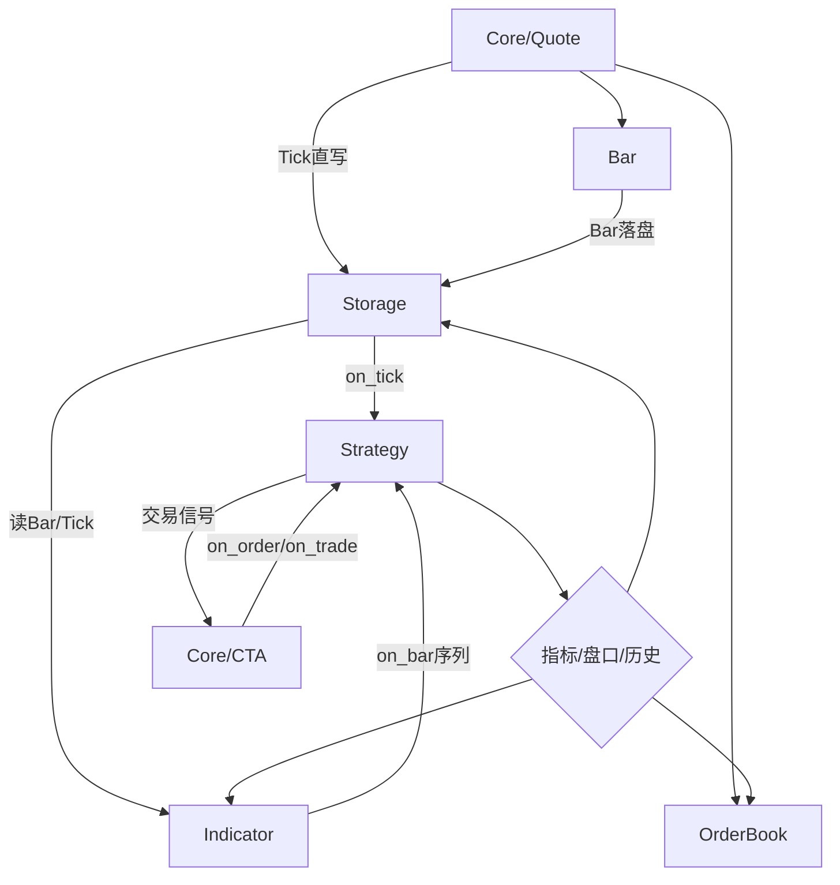
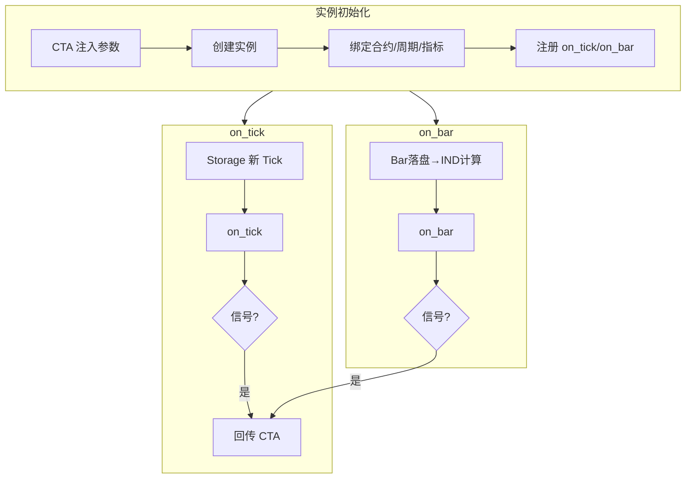
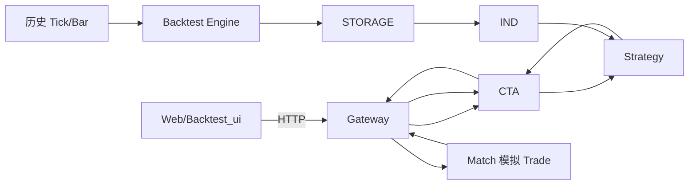

# BLL 逻辑层

> 架构准绳：[`Quant_Sev_Sod.md`](../Quant_Sev_Sod.md) **§3**、**§5.1**  
> 开发进度：[`plan.md`](../plan.md) Phase 3

BLL 负责 **行情衍生、存储、指标、策略运行、回测**。行情驱动链：**不经 CTA**。

---

## 规划目录结构

```
BLL/
├── Readme.md              # 本文档
├── OrderBook/             # Order_Book.cpp — 盘口分析
├── Bar/                   # Bar.cpp — K 线合成
├── Indicator/             # Indicator + Tulip（§3.3）
├── Storage/               # storage.cpp — Tick/Bar 持久化
├── Strategy/              # Strategy_Engine — on_tick/on_bar（§3.4）
└── Backtest/              # 回测引擎 + Match 模拟 Trade（§3.6）
```

---

## 行情驱动总流程（§3.4 / §5.1）



---

## 模块说明

| 目录 | Sod | 输入 | 输出 |
|------|-----|------|------|
| `OrderBook/` | §3.1 | Quote Tick | 盘口序列 → Strategy |
| `Bar/` | §3.2 | Quote Tick | Bar → Storage |
| `Indicator/` | §3.3 | Storage 读 / HTTP 实时直连 | 指标序列 → Strategy / UI |
| `Storage/` | §3.5 | Quote/Bar 写 | Tick/Bar 文件；下游统一读 |
| `Strategy/` | §3.4 | Storage+IND 驱动 | 信号 → CTA |
| `Backtest/` | §3.6 | 历史 CSV 回放 | 信号 → CTA → Gateway → Match |

---

## Strategy 运行进程（§3.4）



---

## 回测流程（§5.2）



回测 **Indicator API** 走 Storage 回放，**不经** Quote 实时链路与 HTTP→IND 直连（与实盘 §5.1 区分）。

---

## 与 Core / UI 接口

| consumer | 用途 |
|----------|------|
| Gateway | Storage 历史查询；IND 实时 API；K 线定时刷新推 WS |
| CTA | Strategy 启停、传参、收信号、发 on_order/on_trade |
| Web/Market_Chart | WS Tick/K线；HTTP 历史 Bar；Indicator API 实盘 |

---

## 当前状态

| 模块 | 状态 | 说明 |
|------|------|------|
| `Common/ContractRules` | ✅ | 解析 `instrument_id`；读取 `Contract_Rules.json` |
| `Storage/` | 🟡 | Tick live 落盘；历史/实盘 m1 读写；`GET /api/bars` |
| `Bar/` | 🟡 | Tick→m1 合成；分钟切换落盘 |
| `Indicator/tulipindicators` | 🟡 | 第三方库已引入 |
| `OrderBook/`、`Strategy/`、`Backtest/` | ⬜ | 待实现 |

**数据路径**（与 `config/Contract_Rules.json` rollover.storageLayout 一致）：

- 历史与实盘：`data/{exchange}/{product}/{month_slot}/m1.csv`、`tick.csv`

详见 [`Indicator/Readme.md`](Indicator/Readme.md)。
