# CTP SDK 完整参考文档

> 基于 `CTP/` 目录**全部 7 个文件**通读整理。  
> 头文件为上海期货信息技术有限公司官方 SDK，**禁止修改**。  
> Quant_Sev 封装：`Core/Quote` ← MdApi；`Core/Trade` ← TraderApi；经 **Gateway** 路由。  
> 架构：[`Quant_Sev_Sod.md`](../Quant_Sev_Sod.md) §1 · 进度：[`plan.md`](../plan.md)

---

## 目录

1. [CTP 整体架构](#1-ctp-整体架构)
2. [目录与文件依赖](#2-目录与文件依赖)
3. [通信机制（Req / Rsp / Rtn）](#3-通信机制req--rsp--rtn)
4. [行情 API：ThostFtdcMdApi.h](#4-行情-apithostftdcmdapih)
5. [交易 API：ThostFtdcTraderApi.h](#5-交易-apithostftdctraderapih)
6. [数据类型：ThostFtdcUserApiDataType.h](#6-数据类型thostftdcuserapidatatypeh)
7. [业务结构体：ThostFtdcUserApiStruct.h（API 相关）](#7-业务结构体thostftdcuserapistructhapi-相关)
8. [错误码 error.xml](#8-错误码-errorxml)
9. [Quant_Sev 模块映射](#9-quant_sev-模块映射)

---

## 1. CTP 整体架构

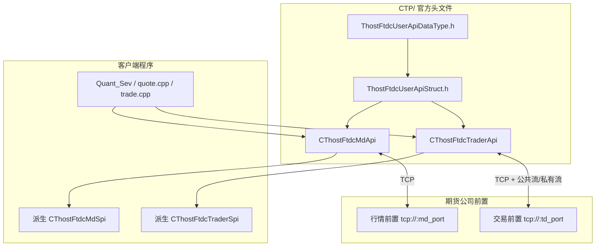

| 层次 | 职责 |
|------|------|
| **Api 类** | 主动发起：Create、Register、Init、Req*、Subscribe* |
| **Spi 类** | 被动回调：OnFront*、OnRsp*（请求应答）、OnRtn*（主推）、OnErrRtn*（错误回报） |
| **Struct** | 请求/应答/主推的 C 结构体字段 |
| **DataType** | 字段用到的 typedef 与枚举常量 |

---

## 2. 目录与文件依赖

```
CTP/                                   【官方 SDK，禁止修改】
├── README.md                          本文档
├── ThostFtdcMdApi.h          (169行)  行情 Api + MdSpi
├── ThostFtdcTraderApi.h     (1041行)  交易 Api + TraderSpi
├── ThostFtdcUserApiStruct.h(13949行)  519 个 CThostFtdc*Field 结构体
├── ThostFtdcUserApiDataType.h(7265行) 844 类类型定义 + 1348 个 THOST_FTDC_* 宏
├── error.xml                  (330行)  ErrorID → 中文 prompt
└── error.dtd                   (10行)  error.xml DTD
```

> **运行时依赖**：需另行部署 `thostmduserapi_se.dll/.so`、`thosttraderapi_se.dll/.so` 及对应 `.lib`，与 Host 链接配置一致；本目录仅含头文件与错误码表。

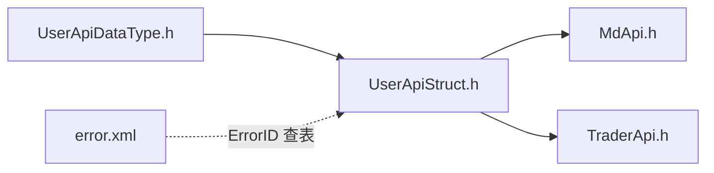

---

## 3. 通信机制（Req / Rsp / Rtn）

### 3.1 三种回调语义

| 前缀 | 含义 | 触发时机 | 典型参数 |
|------|------|----------|----------|
| **OnRsp*** | 请求应答 | 对应 `Req*` 的同步响应 | `pRspInfo`, `nRequestID`, `bIsLast` |
| **OnRtn*** | 主推通知 | 服务器主动推送（无需先发 Req） | 无 `nRequestID` |
| **OnErrRtn*** | 错误回报 | 业务请求被交易所/系统拒绝 | `pRspInfo`（含 ErrorID） |

### 3.2 通用应答结构

```cpp
struct CThostFtdcRspInfoField {
    int  ErrorID;    // 0 = 成功，非 0 查 error.xml
    char ErrorMsg[81];
};
```

### 3.3 请求编号与分页

- 每次 `Req*(..., nRequestID)` 传入递增的 **nRequestID**，在对应 **OnRsp*** 中回传，用于匹配。
- 查询类应答可能分包：**bIsLast=false** 表示还有后续包，**true** 表示最后一包。

### 3.4 交易 API 流机制（TraderApi 独有）

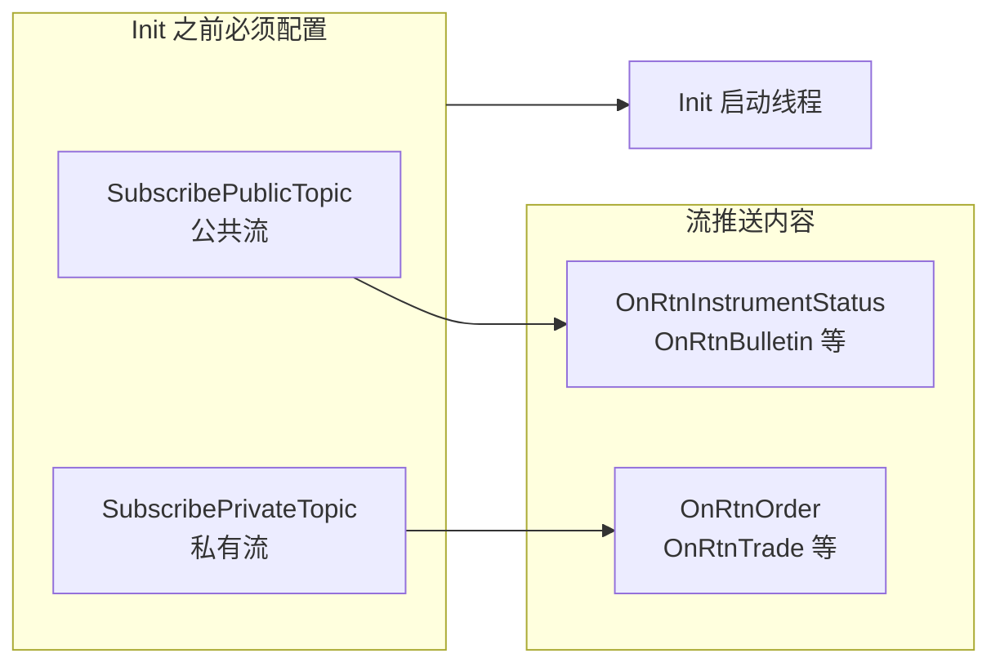

**THOST_TE_RESUME_TYPE**（`UserApiDataType.h` 枚举）：

| 值 | 含义 |
|----|------|
| `THOST_TERT_RESTART` (0) | 从本交易日开始重传 |
| `THOST_TERT_RESUME` (1) | 从上次收到的续传 |
| `THOST_TERT_QUICK` (2) | 只收登录后流内容 |
| `THOST_TERT_NONE` (3) | 取消公共流（仅 PublicTopic） |
| `THOST_TERT_RESUME_FROM_SEQ_NO` (4) | 从指定序号续传（PrivateTopic + nSeqNo） |

登录后 **OnRtnPrivateSeqNo(nSeqNo)** 通知即将处理的私有流序号。

### 3.5 连接与断线（Md / Trader 共用）

| nReason | 含义 |
|---------|------|
| `0x1001` | 网络读失败 |
| `0x1002` | 网络写失败 |
| `0x2001` | 接收心跳超时 |
| `0x2002` | 发送心跳失败 |
| `0x2003` | 收到错误报文 |

断线后 **API 自动重连**；重连成功 **OnFrontConnected** 后须重新登录（Md 须重新订阅）。

---

## 4. 行情 API（ThostFtdcMdApi.h）

### 4.1 类结构

| 类 | 方法数 | 职责 |
|----|--------|------|
| `CThostFtdcMdApi` | 18 | 主动调用 |
| `CThostFtdcMdSpi` | 12 | 回调 |

### 4.2 CThostFtdcMdApi 全部方法

| 方法 | 类型 | 说明 |
|------|------|------|
| `CreateFtdcMdApi(flowPath, bIsUsingUdp, bIsMulticast, bIsProductionMode)` | static | 创建实例；flowPath 存流文件 |
| `GetApiVersion()` | static | API 版本 |
| `Release()` | 实例 | 释放 |
| `Init()` | 实例 | 启动线程、连前置 |
| `Join()` | 实例 | 等待线程结束 |
| `GetTradingDay()` | 实例 | 交易日（登录后有效） |
| `RegisterFront(char* addr)` | 实例 | `tcp://ip:port` |
| `RegisterNameServer(char* addr)` | 实例 | 优先于 RegisterFront |
| `RegisterFensUserInfo(CThostFtdcFensUserInfoField*)` | 实例 | FENS 用户信息 |
| `RegisterSpi(CThostFtdcMdSpi*)` | 实例 | 注册回调 |
| `SubscribeMarketData(char* ids[], int nCount)` | 实例 | 订阅深度行情 |
| `UnSubscribeMarketData(...)` | 实例 | 退订 |
| `SubscribeForQuoteRsp(...)` | 实例 | 订阅询价通知 |
| `UnSubscribeForQuoteRsp(...)` | 实例 | 退订询价 |
| `ReqUserLogin(CThostFtdcReqUserLoginField*, nRequestID)` | 实例 | 登录 |
| `ReqUserLogout(CThostFtdcUserLogoutField*, nRequestID)` | 实例 | 登出 |
| `ReqQryMulticastInstrument(..., nRequestID)` | 实例 | 查询组播合约 |

### 4.3 CThostFtdcMdSpi 全部回调

| 回调 | 类型 | 关联主动调用 |
|------|------|--------------|
| `OnFrontConnected()` | 连接 | Init 后自动 |
| `OnFrontDisconnected(int nReason)` | 连接 | 断线/自动重连 |
| `OnHeartBeatWarning(int nTimeLapse)` | 连接 | 长时间无报文 |
| `OnRspUserLogin(...)` | Rsp | ReqUserLogin |
| `OnRspUserLogout(...)` | Rsp | ReqUserLogout |
| `OnRspQryMulticastInstrument(...)` | Rsp | ReqQryMulticastInstrument |
| `OnRspError(...)` | Rsp | 任意 Req 失败 |
| `OnRspSubMarketData(...)` | Rsp | SubscribeMarketData |
| `OnRspUnSubMarketData(...)` | Rsp | UnSubscribeMarketData |
| `OnRspSubForQuoteRsp(...)` | Rsp | SubscribeForQuoteRsp |
| `OnRspUnSubForQuoteRsp(...)` | Rsp | UnSubscribeForQuoteRsp |
| `OnRtnDepthMarketData(CThostFtdcDepthMarketDataField*)` | **Rtn** | 订阅后推送 |
| `OnRtnForQuoteRsp(CThostFtdcForQuoteRspField*)` | **Rtn** | 询价订阅后推送 |

### 4.4 机制流程图：创建与连接

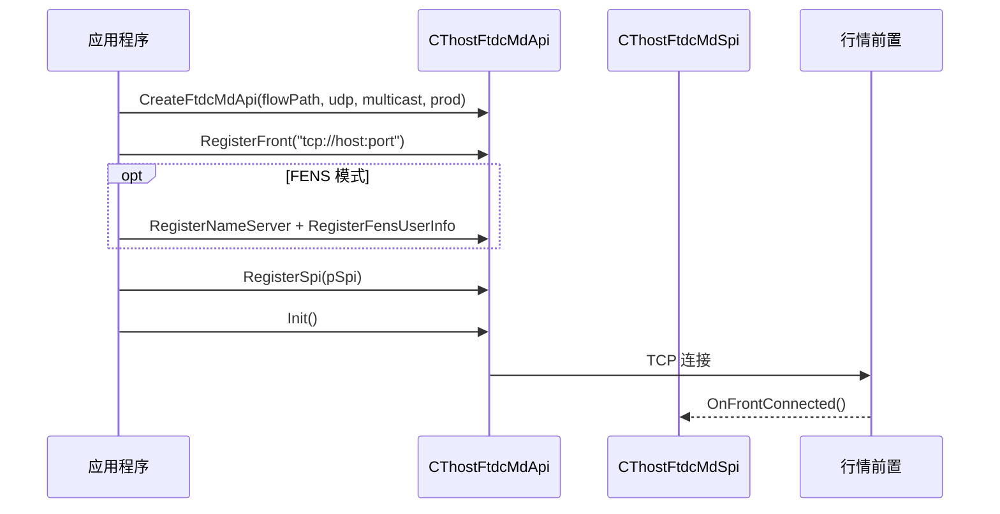

### 4.5 机制流程图：登录

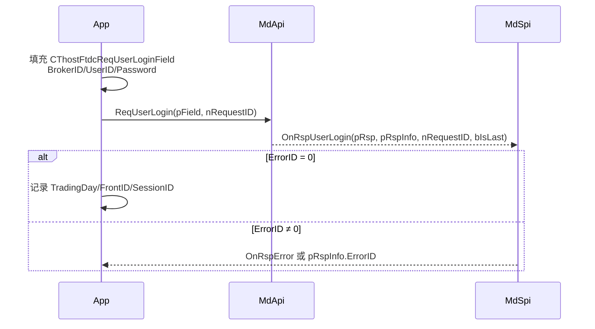

### 4.6 机制流程图：订阅与行情推送

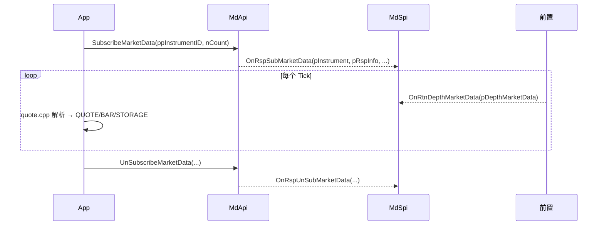

### 4.7 机制流程图：询价订阅


### 4.8 机制流程图：断线重连

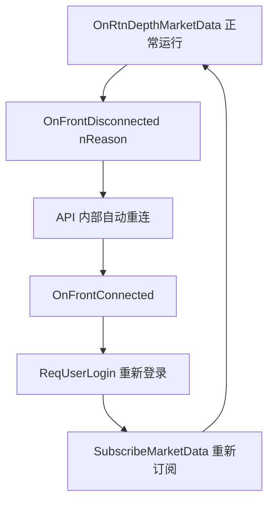

### 4.9 机制流程图：登出与释放


---

## 5. 交易 API（ThostFtdcTraderApi.h）

### 5.1 类结构

| 类 | 规模 | 职责 |
|----|------|------|
| `CThostFtdcTraderApi` | ~130 个 Req/Register 方法 | 主动 |
| `CThostFtdcTraderSpi` | ~170 个回调 | 被动 |

### 5.2 CThostFtdcTraderApi 生命周期方法

| 方法 | 调用时机 |
|------|----------|
| `CreateFtdcTraderApi(flowPath, bIsProductionMode)` | 最先 |
| `RegisterFront` / `RegisterNameServer` / `RegisterFensUserInfo` | Init 前 |
| `RegisterSpi(CThostFtdcTraderSpi*)` | Init 前 |
| **`SubscribePublicTopic(nResumeType)`** | **Init 前** |
| **`SubscribePrivateTopic(nResumeType, nSeqNo=1)`** | **Init 前** |
| `Init()` | 启动 |
| `GetFrontInfo(CThostFtdcFrontInfoField*)` | 连接/登录后 |
| `GetTradingDay()` / `GetApiVersion()` | 任意 |
| `Join()` / `Release()` | 退出 |

### 5.3 机制流程图：完整生命周期

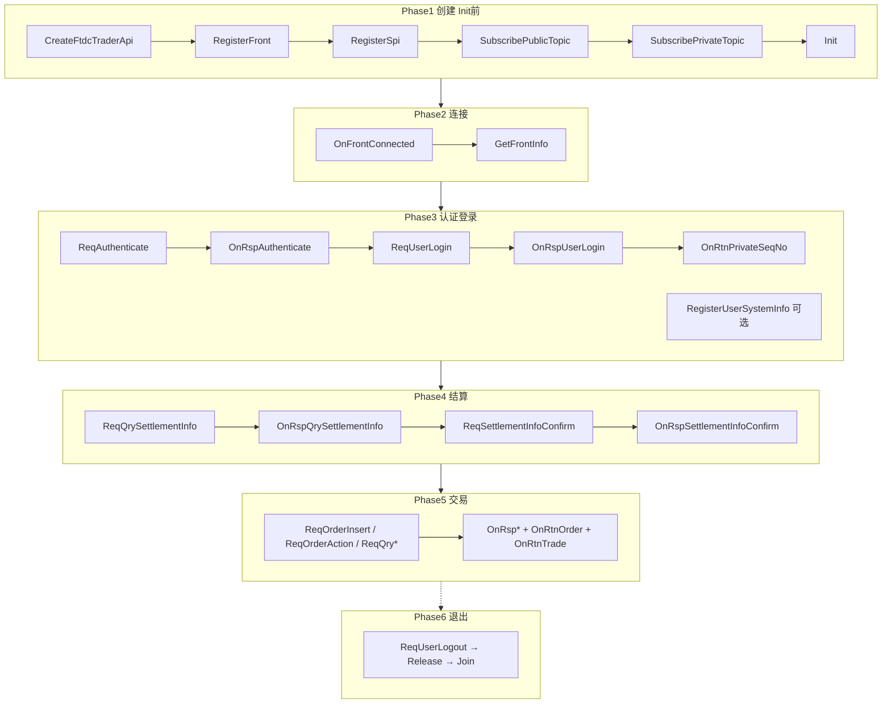

### 5.4 机制流程图：客户端认证

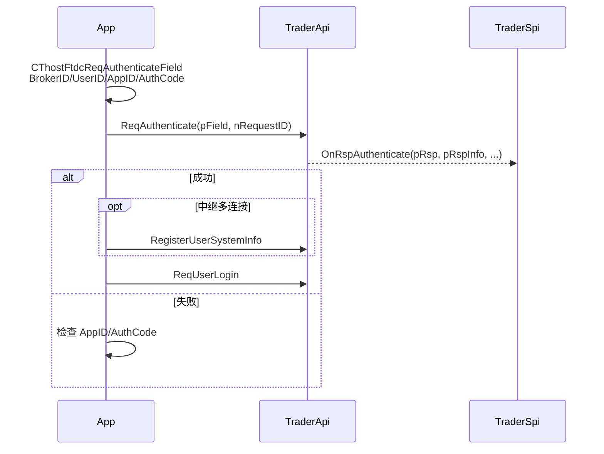

### 5.5 机制流程图：报单（ReqOrderInsert）

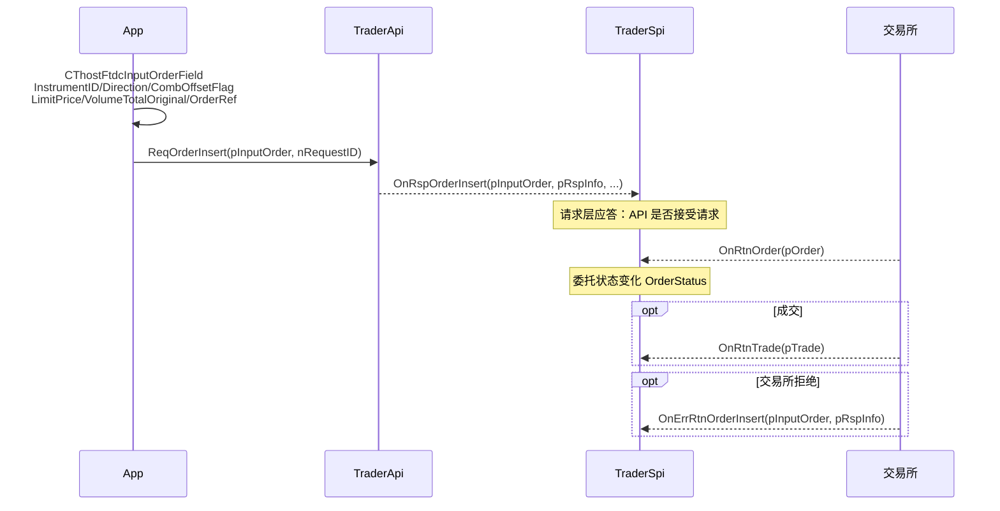

### 5.6 机制流程图：撤单（ReqOrderAction）

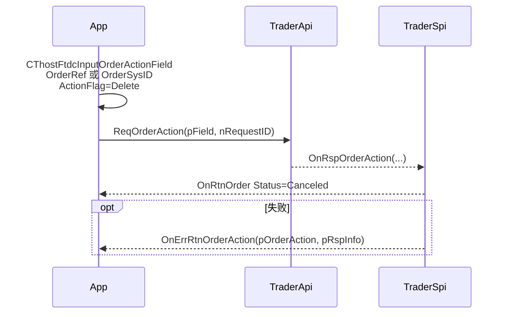

### 5.7 机制流程图：预埋单

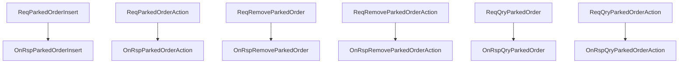

### 5.8 机制流程图：报价与询价

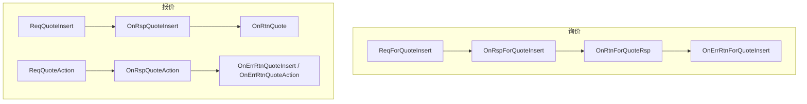

### 5.9 机制流程图：期权执行宣告

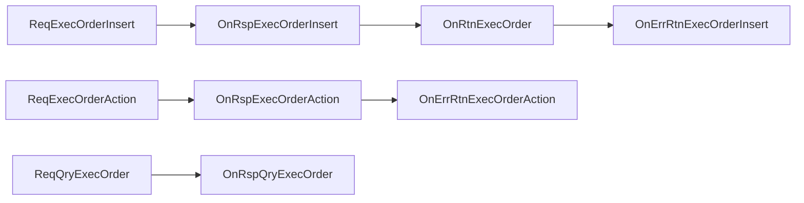

### 5.10 机制流程图：期权自对冲与组合

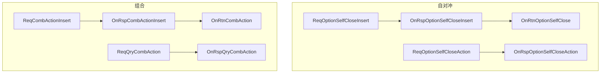

### 5.11 机制流程图：银期转账

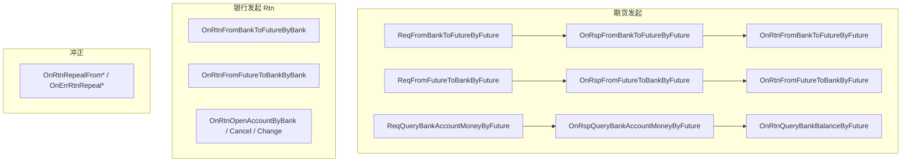

### 5.12 机制流程图：查询类（通用模式）

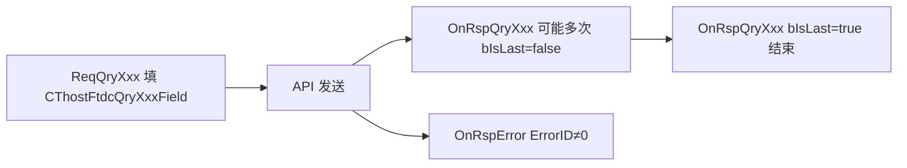

### 5.13 机制流程图：报单状态机

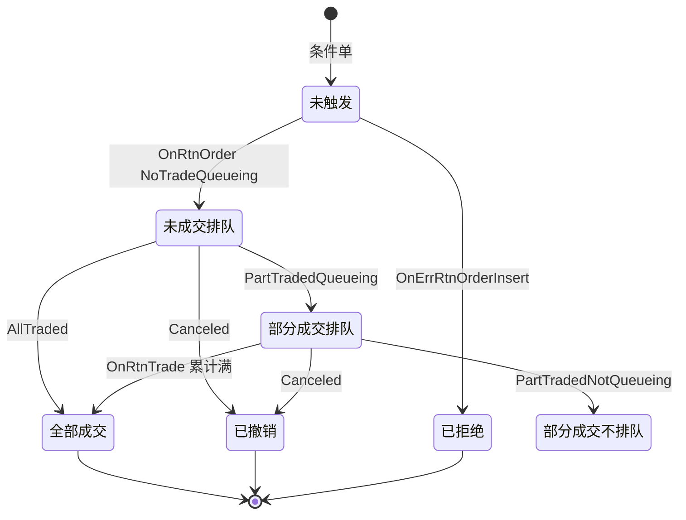

### 5.14 Req → OnRsp 完整对照表

#### 5.14.1 认证 / 登录 / 密码

| Req 方法 | OnRsp 回调 | 备注 |
|----------|------------|------|
| `ReqAuthenticate` | `OnRspAuthenticate` | AppID+AuthCode |
| `ReqUserLogin` | `OnRspUserLogin` | 获 MaxOrderRef/FrontID/SessionID |
| `ReqUserLogout` | `OnRspUserLogout` | |
| `ReqUserPasswordUpdate` | `OnRspUserPasswordUpdate` | |
| `ReqTradingAccountPasswordUpdate` | `OnRspTradingAccountPasswordUpdate` | |
| `ReqUserAuthMethod` | `OnRspUserAuthMethod` | |
| `ReqGenUserCaptcha` | `OnRspGenUserCaptcha` | |
| `ReqGenUserText` | `OnRspGenUserText` | |
| `ReqUserLoginWithCaptcha` | `OnRspUserLogin` | |
| `ReqUserLoginWithText` | `OnRspUserLogin` | |
| `ReqUserLoginWithOTP` | `OnRspUserLogin` | |
| `ReqGenSMSCode` | `OnRspGenSMSCode` | |

#### 5.14.2 报单 / 撤单 / 预埋

| Req 方法 | OnRsp 回调 | OnRtn / OnErrRtn |
|----------|------------|------------------|
| `ReqOrderInsert` | `OnRspOrderInsert` | `OnRtnOrder`, `OnErrRtnOrderInsert` |
| `ReqOrderAction` | `OnRspOrderAction` | `OnRtnOrder`, `OnErrRtnOrderAction` |
| `ReqBatchOrderAction` | `OnRspBatchOrderAction` | `OnErrRtnBatchOrderAction` |
| `ReqParkedOrderInsert` | `OnRspParkedOrderInsert` | |
| `ReqParkedOrderAction` | `OnRspParkedOrderAction` | |
| `ReqRemoveParkedOrder` | `OnRspRemoveParkedOrder` | |
| `ReqRemoveParkedOrderAction` | `OnRspRemoveParkedOrderAction` | |
| `ReqQryMaxOrderVolume` | `OnRspQryMaxOrderVolume` | |

#### 5.14.3 报价 / 询价 / 执行 / 自对冲 / 组合

| Req 方法 | OnRsp | OnRtn / OnErrRtn |
|----------|-------|------------------|
| `ReqForQuoteInsert` | `OnRspForQuoteInsert` | `OnRtnForQuoteRsp`, `OnErrRtnForQuoteInsert` |
| `ReqQuoteInsert` | `OnRspQuoteInsert` | `OnRtnQuote`, `OnErrRtnQuoteInsert` |
| `ReqQuoteAction` | `OnRspQuoteAction` | `OnErrRtnQuoteAction` |
| `ReqExecOrderInsert` | `OnRspExecOrderInsert` | `OnRtnExecOrder`, `OnErrRtnExecOrderInsert` |
| `ReqExecOrderAction` | `OnRspExecOrderAction` | `OnErrRtnExecOrderAction` |
| `ReqOptionSelfCloseInsert` | `OnRspOptionSelfCloseInsert` | `OnRtnOptionSelfClose`, `OnErrRtnOptionSelfCloseInsert` |
| `ReqOptionSelfCloseAction` | `OnRspOptionSelfCloseAction` | `OnErrRtnOptionSelfCloseAction` |
| `ReqCombActionInsert` | `OnRspCombActionInsert` | `OnRtnCombAction`, `OnErrRtnCombActionInsert` |

#### 5.14.4 结算

| Req | OnRsp |
|-----|-------|
| `ReqQrySettlementInfo` | `OnRspQrySettlementInfo` |
| `ReqSettlementInfoConfirm` | `OnRspSettlementInfoConfirm` |
| `ReqQrySettlementInfoConfirm` | `OnRspQrySettlementInfoConfirm` |

#### 5.14.5 核心查询（Quant_Sev 常用）

| Req | OnRsp | 结构体 |
|-----|-------|--------|
| `ReqQryOrder` | `OnRspQryOrder` | `CThostFtdcOrderField` |
| `ReqQryTrade` | `OnRspQryTrade` | `CThostFtdcTradeField` |
| `ReqQryInvestorPosition` | `OnRspQryInvestorPosition` | `CThostFtdcInvestorPositionField` |
| `ReqQryTradingAccount` | `OnRspQryTradingAccount` | `CThostFtdcTradingAccountField` |
| `ReqQryInstrument` | `OnRspQryInstrument` | `CThostFtdcInstrumentField` |
| `ReqQryDepthMarketData` | `OnRspQryDepthMarketData` | `CThostFtdcDepthMarketDataField` |
| `ReqQryInvestor` | `OnRspQryInvestor` | |
| `ReqQryTradingCode` | `OnRspQryTradingCode` | |
| `ReqQryInvestorPositionDetail` | `OnRspQryInvestorPositionDetail` | |
| `ReqQryInstrumentMarginRate` | `OnRspQryInstrumentMarginRate` | |
| `ReqQryInstrumentCommissionRate` | `OnRspQryInstrumentCommissionRate` | |

#### 5.14.6 银期转账

| Req | OnRsp | OnRtn |
|-----|-------|-------|
| `ReqFromBankToFutureByFuture` | `OnRspFromBankToFutureByFuture` | `OnRtnFromBankToFutureByFuture` |
| `ReqFromFutureToBankByFuture` | `OnRspFromFutureToBankByFuture` | `OnRtnFromFutureToBankByFuture` |
| `ReqQueryBankAccountMoneyByFuture` | `OnRspQueryBankAccountMoneyByFuture` | `OnRtnQueryBankBalanceByFuture` |
| `ReqQryTransferBank` | `OnRspQryTransferBank` | |
| `ReqQryTransferSerial` | `OnRspQryTransferSerial` | |
| `ReqQryAccountregister` | `OnRspQryAccountregister` | |
| `ReqQryContractBank` | `OnRspQryContractBank` | |

#### 5.14.7 组合保证金参数（SPBM / SPMM / RCAMS / RULE）

| Req | OnRsp |
|-----|-------|
| `ReqQrySPBMFutureParameter` | `OnRspQrySPBMFutureParameter` |
| `ReqQrySPBMOptionParameter` | `OnRspQrySPBMOptionParameter` |
| `ReqQrySPBMIntraParameter` | `OnRspQrySPBMIntraParameter` |
| `ReqQrySPBMInterParameter` | `OnRspQrySPBMInterParameter` |
| `ReqQrySPBMPortfDefinition` | `OnRspQrySPBMPortfDefinition` |
| `ReqQrySPBMInvestorPortfDef` | `OnRspQrySPBMInvestorPortfDef` |
| `ReqQryInvestorPortfMarginRatio` | `OnRspQryInvestorPortfMarginRatio` |
| `ReqQryInvestorProdSPBMDetail` | `OnRspQryInvestorProdSPBMDetail` |
| `ReqQrySPBMAddOnInterParameter` | `OnRspQrySPBMAddOnInterParameter` |
| `ReqQrySPMMInstParam` | `OnRspQrySPMMInstParam` |
| `ReqQrySPMMProductParam` | `OnRspQrySPMMProductParam` |
| `ReqQryInvestorCommoditySPMMMargin` | `OnRspQryInvestorCommoditySPMMMargin` |
| `ReqQryInvestorCommodityGroupSPMMMargin` | `OnRspQryInvestorCommodityGroupSPMMMargin` |
| `ReqQryRCAMSCombProductInfo` | `OnRspQryRCAMSCombProductInfo` |
| `ReqQryRCAMSInstrParameter` | `OnRspQryRCAMSInstrParameter` |
| `ReqQryRCAMSIntraParameter` | `OnRspQryRCAMSIntraParameter` |
| `ReqQryRCAMSInterParameter` | `OnRspQryRCAMSInterParameter` |
| `ReqQryRCAMSShortOptAdjustParam` | `OnRspQryRCAMSShortOptAdjustParam` |
| `ReqQryRCAMSInvestorCombPosition` | `OnRspQryRCAMSInvestorCombPosition` |
| `ReqQryInvestorProdRCAMSMargin` | `OnRspQryInvestorProdRCAMSMargin` |
| `ReqQryRULEInstrParameter` | `OnRspQryRULEInstrParameter` |
| `ReqQryRULEIntraParameter` | `OnRspQryRULEIntraParameter` |
| `ReqQryRULEInterParameter` | `OnRspQryRULEInterParameter` |
| `ReqQryInvestorProdRULEMargin` | `OnRspQryInvestorProdRULEMargin` |
| `ReqQryInvestorPortfSetting` | `OnRspQryInvestorPortfSetting` |

#### 5.14.8 对冲 / 套利 / 套保

| Req | OnRsp | OnRtn |
|-----|-------|-------|
| `ReqOffsetSetting` | `OnRspOffsetSetting` | `OnRtnOffsetSetting` |
| `ReqCancelOffsetSetting` | `OnRspCancelOffsetSetting` | |
| `ReqQryOffsetSetting` | `OnRspQryOffsetSetting` | |
| `ReqSpdApply` | `OnRspSpdApply` | `OnRtnSpdApply` |
| `ReqSpdApplyAction` | `OnRspSpdApplyAction` | |
| `ReqQrySpdApply` | `OnRspQrySpdApply` | |
| `ReqHedgeCfm` | `OnRspHedgeCfm` | `OnRtnHedgeCfm` |
| `ReqHedgeCfmAction` | `OnRspHedgeCfmAction` | |
| `ReqQryHedgeCfm` | `OnRspQryHedgeCfm` | |

#### 5.14.9 其他 Req（完整列表）

`RegisterUserSystemInfo` / `SubmitUserSystemInfo` / `RegisterWechatUserSystemInfo` / `SubmitWechatUserSystemInfo`（无 OnRsp，同步返回 int）

查询类还包括：`ReqQryExchange`, `ReqQryProduct`, `ReqQryUserSession`, `ReqQryTraderOffer`, `ReqQryNotice`, `ReqQryTradingNotice`, `ReqQryBrokerTradingParams`, `ReqQryBrokerTradingAlgos`, `ReqQueryCFMMCTradingAccountToken`, `ReqQryParkedOrder`, `ReqQryParkedOrderAction`, `ReqQryForQuote`, `ReqQryQuote`, `ReqQryOptionSelfClose`, `ReqQryInvestUnit`, `ReqQryCombInstrumentGuard`, `ReqQryClassifiedInstrument`, `ReqQryCombPromotionParam`, `ReqQryRiskSettleInvstPosition`, `ReqQryRiskSettleProductStatus`, `ReqQryInvestorInfoCommRec`, `ReqQryCombLeg`, `ReqQryEWarrantOffset`, `ReqQryInvestorProductGroupMargin`, `ReqQryExchangeMarginRate`, `ReqQryExchangeMarginRateAdjust`, `ReqQryExchangeRate`, `ReqQrySecAgentACIDMap`, `ReqQryProductExchRate`, `ReqQryProductGroup`, `ReqQryMMInstrumentCommissionRate`, `ReqQryMMOptionInstrCommRate`, `ReqQryInstrumentOrderCommRate`, `ReqQrySecAgentTradingAccount`, `ReqQrySecAgentCheckMode`, `ReqQrySecAgentTradeInfo`, `ReqQryOptionInstrTradeCost`, `ReqQryOptionInstrCommRate`, `ReqQryExecOrder`, `ReqQryCFMMCTradingAccountKey` 等——均有一对一 `OnRspQry*` 回调。

### 5.15 OnRtn / OnErrRtn 主推与错误（无 Req 或补充 Req）

| 回调 | 类型 | 说明 |
|------|------|------|
| `OnFrontConnected` | 连接 | |
| `OnFrontDisconnected` | 连接 | |
| `OnHeartBeatWarning` | 连接 | |
| `OnRtnPrivateSeqNo` | 流 | 私有流序号 |
| `OnRtnOrder` | **Rtn** | 委托状态变化 |
| `OnRtnTrade` | **Rtn** | 成交 |
| `OnErrRtnOrderInsert` | **ErrRtn** | 报单被拒 |
| `OnErrRtnOrderAction` | **ErrRtn** | 撤单被拒 |
| `OnRtnInstrumentStatus` | **Rtn** | 合约交易状态 |
| `OnRtnBulletin` | **Rtn** | 交易所公告 |
| `OnRtnTradingNotice` | **Rtn** | 交易通知 |
| `OnRtnErrorConditionalOrder` | **Rtn** | 条件单校验错误 |
| `OnRtnCFMMCTradingAccountToken` | **Rtn** | 监控中心令牌 |
| `OnRtnQuote` / `OnRtnForQuoteRsp` | **Rtn** | 报价/询价 |
| `OnRtnExecOrder` | **Rtn** | 执行宣告 |
| `OnRtnOptionSelfClose` | **Rtn** | 自对冲 |
| `OnRtnCombAction` | **Rtn** | 组合 |
| `OnRtnOffsetSetting` | **Rtn** | 对冲设置 |
| `OnRtnSpdApply` / `OnRtnHedgeCfm` | **Rtn** | 套利/套保 |
| `OnRtnFromBankToFutureBy*` / `OnRtnFromFutureToBankBy*` | **Rtn** | 银期 |
| `OnRtnOpenAccountByBank` 等 | **Rtn** | 银行侧账户变更 |
| `OnRspError` | Rsp | 通用错误 |

---

## 6. 数据类型（ThostFtdcUserApiDataType.h）

> **说明**：本文件定义的是 **typedef 别名** 与 **枚举常量**（`#define THOST_FTDC_*`），不是 struct。  
> **业务结构体**在 `ThostFtdcUserApiStruct.h`（519 个 `CThostFtdc*Field`）。  
> 统计：**844** 个 `///TFtdc*Type` 定义块，**1348** 个 `THOST_FTDC_*` 宏，**736** 个 `char` typedef，**108** 个数值 typedef。

### 6.1 命名规则

| 模式 | 示例 | 含义 |
|------|------|------|
| `TThostFtdcXxxType` | `TThostFtdcInstrumentIDType` | 字段类型别名 |
| `THOST_FTDC_XXX_Yyy` | `THOST_FTDC_D_Buy` | 枚举常量值 |
| `///TFtdcXxxType是一个…类型` | 中文注释 | 类型说明 |

### 6.2 全局枚举（非 typedef）

```cpp
enum THOST_TE_RESUME_TYPE {
    THOST_TERT_RESTART = 0,       // 从本交易日重传
    THOST_TERT_RESUME,            // 续传
    THOST_TERT_QUICK,             // 只收登录后
    THOST_TERT_NONE,              // 取消公共流
    THOST_TERT_RESUME_FROM_SEQ_NO // 指定序号续传
};
```

### 6.3 基础 typedef（API 高频字段）

| typedef | 底层 | 说明 |
|---------|------|------|
| `TThostFtdcBrokerIDType` | char[11] | 经纪公司代码 |
| `TThostFtdcUserIDType` | char[16] | 用户代码 |
| `TThostFtdcInvestorIDType` | char[13] | 投资者代码 |
| `TThostFtdcInstrumentIDType` | char[81] | 合约代码 |
| `TThostFtdcExchangeIDType` | char[9] | 交易所代码 |
| `TThostFtdcOrderRefType` | char[13] | 报单引用（客户端维护递增） |
| `TThostFtdcOrderSysIDType` | char[21] | 交易所报单编号 |
| `TThostFtdcTradeIDType` | char[21] | 成交编号 |
| `TThostFtdcPasswordType` | char[41] | 密码 |
| `TThostFtdcDateType` | char[9] | 日期 YYYYMMDD |
| `TThostFtdcTimeType` | char[9] | 时间 HH:MM:SS |
| `TThostFtdcPriceType` | double | 价格 |
| `TThostFtdcVolumeType` | int | 数量 |
| `TThostFtdcMoneyType` | double | 资金 |
| `TThostFtdcRatioType` | double | 比率 |
| `TThostFtdcFrontIDType` | int | 前置编号 |
| `TThostFtdcSessionIDType` | int | 会话编号 |
| `TThostFtdcRequestIDType` | int | 请求编号 |
| `TThostFtdcErrorIDType` | int | 错误码 |
| `TThostFtdcMillisecType` | int | 毫秒 |
| `TThostFtdcBoolType` | int | 布尔 |
| `TThostFtdcCombOffsetFlagType` | char[5] | 组合开平（多腿） |
| `TThostFtdcCombHedgeFlagType` | char[5] | 组合投套（多腿） |
| `TThostFtdcDirectionType` | char | 买卖方向 |
| `TThostFtdcOffsetFlagType` | char | 开平标志 |
| `TThostFtdcHedgeFlagType` | char | 投套标志 |
| `TThostFtdcOrderStatusType` | char | 报单状态 |
| `TThostFtdcOrderPriceTypeType` | char | 报单价格条件 |
| `TThostFtdcTimeConditionType` | char | 有效期类型 |
| `TThostFtdcVolumeConditionType` | char | 成交量类型 |
| `TThostFtdcActionFlagType` | char | 操作标志（删/改） |

### 6.4 交易核心枚举（完整常量表）

#### DirectionType 买卖方向

| 宏 | 值 | 含义 |
|----|-----|------|
| `THOST_FTDC_D_Buy` | `'0'` | 买 |
| `THOST_FTDC_D_Sell` | `'1'` | 卖 |

#### OffsetFlagType 开平标志

| 宏 | 值 | 含义 |
|----|-----|------|
| `THOST_FTDC_OF_Open` | `'0'` | 开仓 |
| `THOST_FTDC_OF_Close` | `'1'` | 平仓 |
| `THOST_FTDC_OF_ForceClose` | `'2'` | 强平 |
| `THOST_FTDC_OF_CloseToday` | `'3'` | 平今 |
| `THOST_FTDC_OF_CloseYesterday` | `'4'` | 平昨 |
| `THOST_FTDC_OF_ForceOff` | `'5'` | 强减 |
| `THOST_FTDC_OF_LocalForceClose` | `'6'` | 本地强平 |

#### HedgeFlagType 投机套保

| 宏 | 值 | 含义 |
|----|-----|------|
| `THOST_FTDC_HF_Speculation` | `'1'` | 投机 |
| `THOST_FTDC_HF_Arbitrage` | `'2'` | 套利 |
| `THOST_FTDC_HF_Hedge` | `'3'` | 套保 |
| `THOST_FTDC_HF_MarketMaker` | `'5'` | 做市商 |
| `THOST_FTDC_HF_SpecHedge` | `'6'` | 投机套保 |
| `THOST_FTDC_HF_HedgeSpec` | `'7'` | 套保投机 |

#### OrderPriceTypeType 报单价格条件

| 宏 | 值 | 含义 |
|----|-----|------|
| `THOST_FTDC_OPT_AnyPrice` | `'1'` | 任意价 |
| `THOST_FTDC_OPT_LimitPrice` | `'2'` | 限价 |
| `THOST_FTDC_OPT_BestPrice` | `'3'` | 最优价 |
| `THOST_FTDC_OPT_LastPrice` | `'4'` | 最新价 |
| `THOST_FTDC_OPT_LastPricePlusOneTicks` | `'5'` | 最新价+1tick |
| … | `'6'`~`'F'` | 最新价+Ntick / 买一卖一 / 五档价 |
| `THOST_FTDC_OPT_FiveLevelPrice` | `'G'` | 五档价 |

#### TimeConditionType 有效期

| 宏 | 值 | 含义 |
|----|-----|------|
| `THOST_FTDC_TC_IOC` | `'1'` | 立即完成否则撤销 |
| `THOST_FTDC_TC_GFS` | `'2'` | 本节有效 |
| `THOST_FTDC_TC_GFD` | `'3'` | 当日有效 |
| `THOST_FTDC_TC_GTD` | `'4'` | 指定日期前有效 |
| `THOST_FTDC_TC_GTC` | `'5'` | 撤销前有效 |
| `THOST_FTDC_TC_GFA` | `'6'` | 集合竞价有效 |

#### VolumeConditionType 成交量类型

| 宏 | 值 | 含义 |
|----|-----|------|
| `THOST_FTDC_VC_AV` | `'1'` | 任何数量 |
| `THOST_FTDC_VC_MV` | `'2'` | 最小数量 |
| `THOST_FTDC_VC_CV` | `'3'` | 全部数量 |

#### OrderStatusType 报单状态

| 宏 | 值 | 含义 |
|----|-----|------|
| `THOST_FTDC_OST_AllTraded` | `'0'` | 全部成交 |
| `THOST_FTDC_OST_PartTradedQueueing` | `'1'` | 部分成交还在队列 |
| `THOST_FTDC_OST_PartTradedNotQueueing` | `'2'` | 部分成交不在队列 |
| `THOST_FTDC_OST_NoTradeQueueing` | `'3'` | 未成交还在队列 |
| `THOST_FTDC_OST_NoTradeNotQueueing` | `'4'` | 未成交不在队列 |
| `THOST_FTDC_OST_Canceled` | `'5'` | 撤单 |
| `THOST_FTDC_OST_Unknown` | `'a'` | 未知 |
| `THOST_FTDC_OST_NotTouched` | `'b'` | 尚未触发 |
| `THOST_FTDC_OST_Touched` | `'c'` | 已触发 |

#### OrderSubmitStatusType 报单提交状态

| 宏 | 值 | 含义 |
|----|-----|------|
| `THOST_FTDC_OSS_InsertSubmitted` | `'0'` | 已经提交 |
| `THOST_FTDC_OSS_CancelSubmitted` | `'1'` | 撤单已经提交 |
| `THOST_FTDC_OSS_ModifySubmitted` | `'2'` | 修改已经提交 |
| `THOST_FTDC_OSS_Accepted` | `'3'` | 已经接受 |
| `THOST_FTDC_OSS_InsertRejected` | `'4'` | 报单已经被拒绝 |
| `THOST_FTDC_OSS_CancelRejected` | `'5'` | 撤单已经被拒绝 |
| `THOST_FTDC_OSS_ModifyRejected` | `'6'` | 改单已经被拒绝 |

#### ActionFlagType 操作标志

| 宏 | 值 | 含义 |
|----|-----|------|
| `THOST_FTDC_AF_Delete` | `'0'` | 删除（撤单） |
| `THOST_FTDC_AF_Modify` | `'3'` | 修改 |

#### OrderTypeType 报单类型

| 宏 | 值 | 含义 |
|----|-----|------|
| `THOST_FTDC_ORDT_Normal` | `'0'` | 正常 |
| `THOST_FTDC_ORDT_DeriveFromQuote` | `'1'` | 报价衍生 |
| `THOST_FTDC_ORDT_DeriveFromCombination` | `'2'` | 组合衍生 |
| `THOST_FTDC_ORDT_Combination` | `'3'` | 组合报单 |
| `THOST_FTDC_ORDT_ConditionalOrder` | `'4'` | 条件单 |
| `THOST_FTDC_ORDT_Swap` | `'5'` | 互换单 |

#### InstrumentStatusType 合约交易状态

| 宏 | 值 | 含义 |
|----|-----|------|
| `THOST_FTDC_IS_BeforeTrading` | `'0'` | 开盘前 |
| `THOST_FTDC_IS_NoTrading` | `'1'` | 非交易 |
| `THOST_FTDC_IS_Continous` | `'2'` | 连续交易 |
| `THOST_FTDC_IS_AuctionOrdering` | `'3'` | 集合竞价报单 |
| `THOST_FTDC_IS_AuctionBalance` | `'4'` | 集合竞价价格平衡 |
| `THOST_FTDC_IS_AuctionMatch` | `'5'` | 集合竞价撮合 |
| `THOST_FTDC_IS_Closed` | `'6'` | 收盘 |
| `THOST_FTDC_IS_TransactionProcessing` | `'7'` | 交易业务处理 |

#### ProductClassType 产品类型

| 宏 | 值 | 含义 |
|----|-----|------|
| `THOST_FTDC_PC_Futures` | `'1'` | 期货 |
| `THOST_FTDC_PC_Options` | `'2'` | 期权 |
| `THOST_FTDC_PC_Combination` | `'3'` | 组合 |
| `THOST_FTDC_PC_Spot` | `'4'` | 即期 |
| `THOST_FTDC_PC_EFP` | `'5'` | 期转现 |
| `THOST_FTDC_PC_SpotOption` | `'6'` | 现货期权 |
| `THOST_FTDC_PC_TAS` | `'7'` | TAS |
| `THOST_FTDC_PC_MI` | `'I'` | 金属指数 |

#### PosiDirectionType 持仓方向

| 宏 | 值 | 含义 |
|----|-----|------|
| `THOST_FTDC_PD_Net` | `'1'` | 净 |
| `THOST_FTDC_PD_Long` | `'2'` | 多头 |
| `THOST_FTDC_PD_Short` | `'3'` | 空头 |

#### TradeTypeType 成交类型

| 宏 | 值 | 含义 |
|----|-----|------|
| `THOST_FTDC_TRDT_Common` | `'0'` | 普通成交 |
| `THOST_FTDC_TRDT_OptionsExecution` | `'1'` | 期权执行 |
| `THOST_FTDC_TRDT_OTC` | `'2'` | OTC成交 |
| `THOST_FTDC_TRDT_EFPDerived` | `'3'` | 期转现衍生 |
| `THOST_FTDC_TRDT_CombinationDerived` | `'4'` | 组合衍生 |
| `THOST_FTDC_TRDT_BlockTrade` | `'5'` | 大宗交易 |

#### ContingentConditionType 触发条件（节选）

| 宏 | 值 | 含义 |
|----|-----|------|
| `THOST_FTDC_CC_Immediately` | `'1'` | 立即 |
| `THOST_FTDC_CC_Touch` | `'2'` | 止损 |
| `THOST_FTDC_CC_TouchProfit` | `'3'` | 止赢 |
| `THOST_FTDC_CC_ParkedOrder` | `'4'` | 预埋单 |
| `THOST_FTDC_CC_LastPriceGreaterThanStopPrice` | `'5'` | 最新价>条件价 |
| … | `'6'`~`'H'` | 最新价/买卖价与条件价比较组合 |

### 6.5 类型分类索引（844 类完整名称）

> 以下按业务域列出 `TThostFtdc*Type` 名称；**每个名称的 typedef/枚举值以头文件 `///TFtdc` 注释为准**。

#### A. 标识与基础（约 60 项）

`TraderIDType`, `InvestorIDType`, `BrokerIDType`, `UserIDType`, `InstrumentIDType`, `ExchangeIDType`, `OrderRefType`, `OrderSysIDType`, `TradeIDType`, `ClientIDType`, `PasswordType`, `DateType`, `TimeType`, `PriceType`, `VolumeType`, `MoneyType`, `FrontIDType`, `SessionIDType`, `RequestIDType`, `ErrorIDType`, `MacAddressType`, `IPAddressType`, `ProductInfoType`, `ProtocolInfoType`, …

#### B. 报单 / 委托 / 成交（约 35 项）

`OrderStatusType`, `OrderSubmitStatusType`, `OrderActionStatusType`, `OrderPriceTypeType`, `OrderTypeType`, `OrderSourceType`, `OrderLocalIDType`, `DirectionType`, `OffsetFlagType`, `CombOffsetFlagType`, `CombHedgeFlagType`, `HedgeFlagType`, `ActionFlagType`, `TimeConditionType`, `VolumeConditionType`, `ContingentConditionType`, `ForceCloseReasonType`, `TradeTypeType`, `PriceSourceType`, `ParkedOrderStatusType`, `ParkedOrderIDType`, …

#### C. 持仓 / 合约 / 产品（约 40 项）

`PosiDirectionType`, `PositionTypeType`, `PositionDateType`, `ProductClassType`, `APIProductClassType`, `InstLifePhaseType`, `InstrumentStatusType`, `InstStatusEnterReasonType`, `VolumeMultipleType`, `TradingRoleType`, `SpecPosiTypeType`, …

#### D. 资金 / 结算 / 保证金（约 80 项）

`TradingAccount*`, `Settlement*`, `Margin*`, `Commission*`, `RatioAttrType`, `SysSettlementStatusType`, `SettlementStatusType`, `InvestorPortf*`, `SPBM*`, `SPMM*`, `RCAMS*`, `RULE*`, …

#### E. 连接 / 同步 / 功能码（约 25 项）

`DataSyncStatusType`, `ExchangeConnectStatusType`, `TraderConnectStatusType`, `FunctionCodeType`, `BrokerFunctionCodeType`, `TopicIDType`, …

#### F. 银期 / 银行（约 50 项）

`BankIDType`, `TransferTypeType`, `FutureAccountType`, `RetCodeType`, `VirementStatusType`, `TransferValidFlagType`, `CurrencyCodeType`, …

#### G. 风控 / AML / 通知（约 40 项）

`RiskLevelType`, `AML*`, `Notice*`, `Bulletin*`, `TradingNotice*`, `CFMMC*`, …

#### H. 文件 / 参数 / 运维（约 100 项）

`FileIDType`, `SystemParamIDType`, `TradeParamIDType`, `SettlementParam*`, `LogLevelType`, `UserEvent*`, …

#### I. 其他扩展（约 400+ 项）

包含二级代理、套保确认、套利申请、对冲设置、组合腿、影像、票据、仓库、品牌等扩展业务类型。**完整 844 项请直接检索头文件 `///TFtdc` 注释行**。

---

## 7. 业务结构体（ThostFtdcUserApiStruct.h，API 相关）

> 共 **519** 个 `struct CThostFtdc*Field`。以下列出 Md/Trader API **直接引用**的核心结构体字段。

### 7.1 CThostFtdcRspInfoField（通用错误）

| 字段 | 类型 | 说明 |
|------|------|------|
| ErrorID | TThostFtdcErrorIDType | 0=成功 |
| ErrorMsg | TThostFtdcErrorMsgType | 错误描述 |

### 7.2 CThostFtdcReqUserLoginField / RspUserLoginField

**请求**：BrokerID, UserID, Password, UserProductInfo, InterfaceProductInfo, MacAddress, ClientIPAddress, …

**应答**：TradingDay, LoginTime, FrontID, SessionID, **MaxOrderRef**, 各交易所时间, SysVersion

### 7.3 CThostFtdcReqAuthenticateField

BrokerID, UserID, AppID, AuthCode

### 7.4 CThostFtdcInputOrderField（报单输入）

| 字段 | 类型 | 说明 |
|------|------|------|
| BrokerID / InvestorID | | 经纪商/投资者 |
| InstrumentID | | 合约 |
| OrderRef | | 报单引用（客户端递增） |
| OrderPriceType | | 价格条件 |
| Direction | | 买/卖 |
| CombOffsetFlag | | 开平（组合） |
| CombHedgeFlag | | 投套 |
| LimitPrice | | 价格 |
| VolumeTotalOriginal | | 数量 |
| TimeCondition | | 有效期 |
| VolumeCondition | | 成交量类型 |
| ContingentCondition | | 触发条件 |
| ExchangeID / ClientID | | 交易所/交易编码 |

### 7.5 CThostFtdcOrderField（委托回报）

在 InputOrder 基础上增加：**OrderStatus**, **OrderSubmitStatus**, VolumeTraded, VolumeTotal, InsertDate/Time, ActiveTime, CancelTime, OrderSysID, FrontID, SessionID, StatusMsg, …

### 7.6 CThostFtdcTradeField（成交回报）

BrokerID, InvestorID, InstrumentID, OrderRef, TradeID, Direction, OrderSysID, OffsetFlag, HedgeFlag, **Price**, **Volume**, TradeDate, TradeTime, TradeType, …

### 7.7 CThostFtdcInputOrderActionField（撤单）

BrokerID, InvestorID, OrderRef, FrontID, SessionID, ExchangeID, OrderSysID, **ActionFlag**, InstrumentID, …

### 7.8 CThostFtdcDepthMarketDataField（深度行情）

TradingDay, InstrumentID, ExchangeID, **LastPrice**, OpenPrice, HighestPrice, LowestPrice, Volume, Turnover, OpenInterest, UpperLimitPrice, LowerLimitPrice, **UpdateTime/UpdateMillisec**, **BidPrice1~5/BidVolume1~5**, **AskPrice1~5/AskVolume1~5**, AveragePrice, ActionDay

### 7.9 CThostFtdcTradingAccountField（资金）

AccountID, PreBalance, Balance, Available, CurrMargin, CloseProfit, PositionProfit, Commission, Deposit, Withdraw, RiskDegree, …

### 7.10 CThostFtdcInvestorPositionField（持仓）

InstrumentID, PosiDirection, HedgeFlag, Position, YdPosition, TodayPosition, OpenVolume, CloseVolume, PositionCost, UseMargin, PositionProfit, …

### 7.11 CThostFtdcInstrumentField（合约）

InstrumentID, ExchangeID, InstrumentName, ProductClass, DeliveryYear/Month, VolumeMultiple, PriceTick, CreateDate, OpenDate, ExpireDate, IsTrading, …

---

## 8. 错误码 error.xml

- 格式：`<error id="NAME" value="N" prompt="CTP:中文说明"/>`
- 用法：所有 `OnRsp*` / `OnErrRtn*` 的 `pRspInfo->ErrorID` 查表
- 常见：

| value | prompt |
|-------|--------|
| 0 | 正确 |
| 3 | 不合法的登录 |
| 6 | 还没有登录 |
| 16 | 找不到合约 |
| 22 | 不允许重复报单 |
| 25 | 撤单找不到相应报单 |

```mermaid
flowchart TB
    CB[任意回调 pRspInfo] --> CHK{ErrorID==0?}
    CHK -->|是| OK[继续业务状态机]
    CHK -->|否| XML[查 error.xml]
    XML --> ACT{分类处理}
    ACT -->|认证/登录| RELOGIN[重登]
    ACT -->|报单| FIX[修正字段]
    ACT -->|流控| WAIT[等待重试]
```

---

## 9. Quant_Sev 模块映射

```mermaid
flowchart LR
    MD[CTP 行情前置] <-->|MdApi| QUOTE[quote.cpp]
    TD[CTP 交易前置] <-->|TraderApi| TRADE[trade.cpp]
    QUOTE --> GW[Gateway]
    TRADE --> GW
    GW --> CTA[CTA_Engine]
    GW --> UI[Web UI]
```

| CTP 机制 | Quant_Sev |
|----------|-----------|
| `OnRtnDepthMarketData` | quote → QUOTE → BAR/STORAGE/Gateway→WS |
| `SubscribeMarketData` | Symbol→Gateway→Quote 触发 |
| `ReqOrderInsert` | Gateway→trade（策略经 CTA） |
| `OnRtnOrder` / `OnRtnTrade` | trade→Gateway→CTA→UI |

---

## 附录 A：MdApi 典型调用顺序

```
CreateFtdcMdApi → RegisterFront → RegisterSpi → Init
→ OnFrontConnected → ReqUserLogin → OnRspUserLogin(0)
→ SubscribeMarketData → OnRspSubMarketData
→ [循环] OnRtnDepthMarketData
→ [断线] OnFrontDisconnected → 自动重连 → 重新登录 → 重新订阅
→ ReqUserLogout → Release
```

## 附录 B：TraderApi 典型调用顺序

```
CreateFtdcTraderApi → RegisterFront → RegisterSpi
→ SubscribePublicTopic + SubscribePrivateTopic → Init
→ OnFrontConnected → ReqAuthenticate → OnRspAuthenticate(0)
→ ReqUserLogin → OnRspUserLogin(0) → OnRtnPrivateSeqNo
→ ReqQrySettlementInfo → ReqSettlementInfoConfirm
→ ReqQryInstrument / TradingAccount / InvestorPosition
→ ReqOrderInsert → OnRspOrderInsert → OnRtnOrder → OnRtnTrade
→ ReqOrderAction → OnRspOrderAction → OnRtnOrder(Canceled)
→ ReqUserLogout → Release → Join
```

---

*文档依据 CTP/ 目录全部头文件与 error.xml 整理。类型与结构体完整定义以官方头文件为准。*
