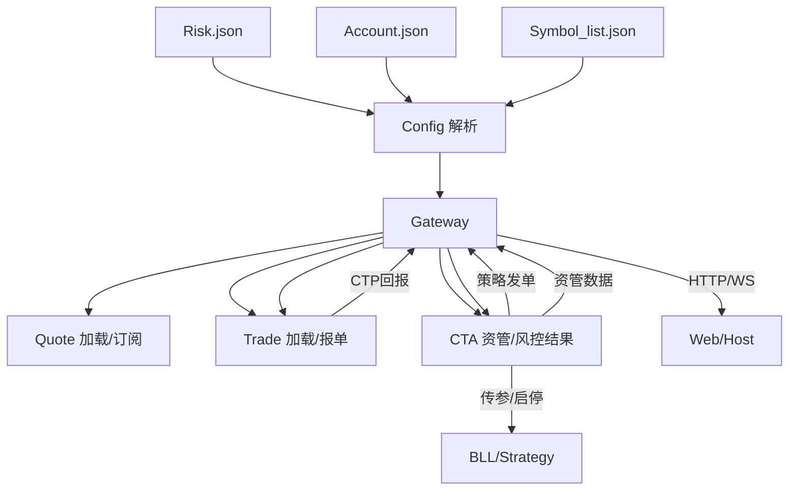
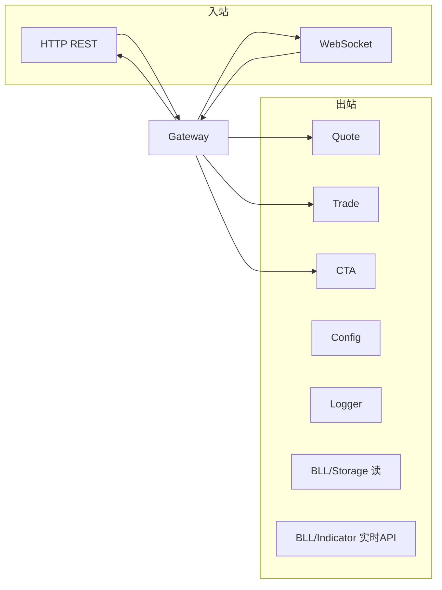
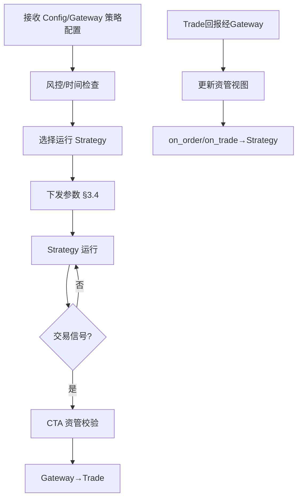

# Core 业务层

> 架构准绳：[`Quant_Sev_Sod.md`](../Quant_Sev_Sod.md) **§2**、**§5.1**  
> 系统结构：[`frame.md`](../frame.md) **§3**  
> 开发进度：[`plan.md`](../plan.md) Phase 2

Core 层负责 **CTP 封装、配置解析、Gateway 统一路由、CTA 资管管控**。Trade **仅**经 Gateway；UI/CTA **禁止**直连 Trade。

---

## 规划目录结构

```
Core/
├── Readme.md           # 本文档
├── Gateway/            # 网关：路由、加载控制、时段统计、HTTP/WS 桥接
├── Config/             # 配置中心：解析 Account/Symbol/Risk JSON
├── Account/            # Account.cpp — 账户加载链
├── Symbol/             # Symbol.cpp — 品种与订阅链
├── Quote/              # quote.cpp — CTP MdApi，Tick 分发
├── Trade/              # trade.cpp — CTP TraderApi，报撤单与回报
├── Risk/               # Risk — 频率/持仓/资金/应急（含 Time_Check 配置消费）
├── TimeCheck/          # 时间校验（与 Risk.json 时间规则联动）
├── CTA/                # CTA_Engine — 资管中心
└── Logger/             # 日志 — 回传 Gateway
```

> 当前仓库 **Core/Account、Symbol、Quote、Trade、Gateway** 已建；CTA/Risk 待 Phase 2+。

---

## 模块与 Sod 对照

| 模块 | Sod | 管控/数据链 |
|------|-----|-------------|
| Account | §2.1 | UI→HTTP→Gateway；ACCOUNT→CONFIG→Gateway→Trade |
| Symbol | §2.2 | SYMBOL→CONFIG→Gateway→Quote 订阅 |
| Time_Check | §2.3 | RISK→CONFIG→Gateway（时段）→CTA |
| Risk | §2.4 | RISK→CONFIG→Gateway（执行）→CTA（放行） |
| Trade | §2.5 | **仅** Gateway→Trade；回报 Trade→Gateway→CTA |
| Quote | §2.6 | Gateway 控制加载；Tick→Storage/Gateway→WS |
| CTA | §2.7 | 选策略、传参、启停；维护资金/持仓/委托视图 |

---

## 管控总流程



---

## Gateway 职责（§5.1）



| 路径类型 | 示例 |
|----------|------|
| 人工报单 | UI→HTTP→Gateway→**Trade**（不经 CTA 发信号） |
| 策略发单 | Strategy→CTA→Gateway→Trade |
| 资管查询 | UI→HTTP→Gateway→**CTA** |
| Tick/K线 | Quote/Storage→Gateway→WS→UI |
| 模块加载 | UI→HTTP→Gateway→Account/Symbol/Quote/Trade |

---

## CTA_Engine（§2.7）



**禁止**：CTA 向 Strategy 推送 Tick/Bar（行情走 QUOTE→BAR→STORAGE→IND）。

---

## Trade 隔离原则

- 发单：**Gateway → Trade**（策略路径含 CTA）
- 回报：**Trade → Gateway → CTA → Gateway → UI**
- **无** Trade 本地资金/持仓镜像；**CTA 为资管中心**

---

## 依赖

| 上游 | 下游 |
|------|------|
| `CTP/` | Quote、Trade |
| `BLL/` | Gateway 读 Storage/IND；CTA 连 Strategy |
| `Host/` | Gateway 暴露 HTTP/WS |
| `Web/` | 经 Host 访问 Gateway |
