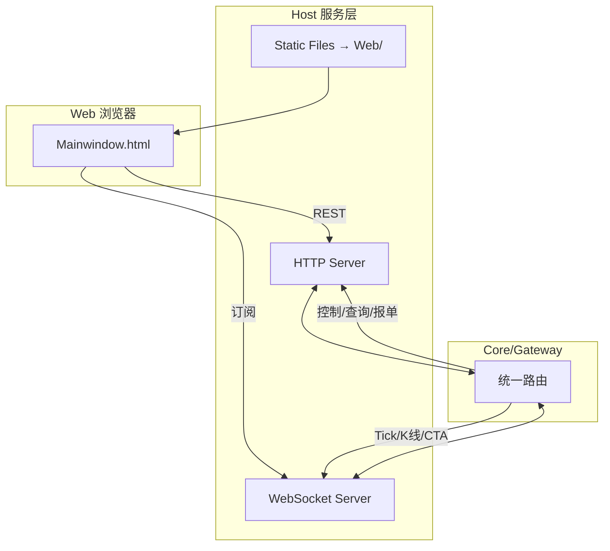
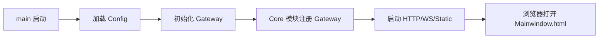

# Host 服务层

> 架构准绳：[`Quant_Sev_Sod.md`](../Quant_Sev_Sod.md) **§4.1**、**§5.1 Host_Layer**  
> 系统结构：[`frame.md`](../frame.md) **§6、§7**  
> 开发进度：[`plan.md`](../plan.md) Phase 1

Host 是 **C++ 进程入口**，提供 HTTP / WebSocket / 静态文件服务，作为 **Web UI 与 Core/Gateway** 之间的唯一网络层。

---

## 规划目录结构

```
Host/
├── Readme.md              # 本文档
├── main.cpp               # 进程入口：启动 Gateway、Host 服务
├── HttpServer/            # REST /api/*
├── WebSocketServer/       # Tick、K线、CTA 资管推送
├── StaticServer/          # 托管 Web/ 目录
└── bridges/               # 或输出到 Web/ 同级
    ├── logger_Bridge.js
    ├── tick_Bridge.js
    ├── TradeView_Bridge.js
    ├── trade_Bridge.js
    ├── Strategies_Bridge.js
    └── Backtest_Bridge.js
```

> 当前仓库 **Host/main.cpp + TickWsServer** 已建（HTTP :8080 + WS :8081）；WebSocket Tick 推送可用。

---

## 在系统中的位置



---

## HTTP API（规划）

| 类别 | 示例路径 | 转发 |
|------|----------|------|
| 状态 | `GET /api/status` | Gateway（md_ok/td_ok） |
| 账户 | `GET /api/saved_accounts` | Config/Account |
| 加载控制 | `POST /api/load_*` | Gateway→Account/Symbol/Quote/Trade |
| 人工报单 | `POST /api/order` | Gateway→**Trade** |
| 资管查询 | `GET /api/orders` 等 | Gateway→**CTA** |
| 历史数据 | `GET /api/bars` | Gateway→Storage |
| 实时指标 | `GET /api/indicator` | Gateway→IND 直连 |
| 策略 | `POST /api/strategy/*` | Gateway→CTA |
| 日志 | `GET /api/ui_logs` | Gateway→Logger |

---

## WebSocket 主题（规划）

| 主题 | 数据源 | 消费者 |
|------|--------|--------|
| Tick | Quote→Gateway | tick_Bridge、Market_Chart |
| K 线 | Storage 定时刷新→Gateway | TradeView_Bridge |
| 委托/持仓/资金 | CTA→Gateway | trade_Bridge、Trade_Query |
| 风控告警 | Gateway | Risk_ui |

---

## Bridge 脚本职责

由 Host **与 Web/ 一并部署**（见 [`Web/Readme.md`](../Web/Readme.md)）：

| 脚本 | 协议 | 作用 |
|------|------|------|
| `logger_Bridge.js` | HTTP | `QuantSevBridge.Logger`、账户 API、autoInitPage |
| `tick_Bridge.js` | WS | 实时 Tick |
| `TradeView_Bridge.js` | HTTP+WS | 合约列表、K 线 |
| `trade_Bridge.js` | HTTP | 人工报单/撤单 |
| `Strategies_Bridge.js` | HTTP | 策略启停/传参 |
| `Backtest_Bridge.js` | HTTP | 回测任务 |

全局对象：`window.QuantSevBridge`（HTTP 模式）或 `window.UICore`（嵌入式，可选）。

---

## 启动流程（规划）



---

## 依赖

| 模块 | 关系 |
|------|------|
| `Web/` | Static 根目录 |
| `Core/Gateway` | 所有 /api 与 WS 的业务后端 |
| `plan.md` | Phase 1 首要实现目标 |
