# Quant\_Sev 详细流程图设计文档

> 本文档在原有架构基础上，补全 CTP 层、业务层（Core）、逻辑层（BLL）、UI 层的详细流程图。
>
> 版本：v1.5\
> 日期：2026-05-30\
> **v1.5 变更**：§5.1 去重并标注双发单入口与 Indicator API 实盘/回测区分；§2.3/§3.4 合并为 §3.4；§4.1 对齐 `Web/` 实际文件；新增 `Web/Readme.md`。

***

## 目录

1. [CTP 层详细流程图](#1-ctp-层详细流程图)
2. [业务层（Core）详细流程图](#2-业务层core详细流程图)
3. [逻辑层（BLL）详细流程图](#3-逻辑层bll详细流程图)
4. [UI 可视化界面流程图](#4-ui-可视化界面流程图)
5. [完整系统数据流图](#5-完整系统数据流图)

***

## 1. CTP 层详细流程图

### 1.1 行情 API（CThostFtdcMdApi）完整生命周期

```mermaid
flowchart TB
    subgraph MdApi_Create[创建与初始化]
        direction TB
        M1[CreateFtdcMdApi<br/>pszFlowPath/bIsUsingUdp/bIsMulticast/bIsProductionMode] --> M2[RegisterFront<br/>注册行情前置地址]
        M2 --> M3[RegisterSpi<br/>注册回调接口 CThostFtdcMdSpi]
        M3 --> M4[Init<br/>初始化运行环境]
        M4 --> M5[等待 OnFrontConnected 回调]
    end

    subgraph MdApi_Connect[连接与登录]
        direction TB
        M6[OnFrontConnected<br/>前置连接成功] --> M7[构造 CThostFtdcReqUserLoginField]
        M7 --> M8[填充 BrokerID/UserID/Password]
        M8 --> M9[ReqUserLogin<br/>发送登录请求]
        M9 --> M10{OnRspUserLogin}
        M10 -->|ErrorID=0| M11[登录成功<br/>记录 FrontID/SessionID]
        M10 -->|ErrorID≠0| M12[登录失败<br/>检查密码/权限]
    end

    subgraph MdApi_Subscribe[订阅行情]
        direction TB
        M13[准备合约列表<br/>char* ppInstrumentID[]] --> M14[SubscribeMarketData<br/>订阅行情]
        M14 --> M15{OnRspSubMarketData}
        M15 -->|成功| M16[标记合约已订阅]
        M15 -->|失败| M17[记录错误合约]
        
        M18[UnSubscribeMarketData<br/>退订行情] --> M19{OnRspUnSubMarketData}
        
        M20[SubscribeForQuoteRsp<br/>订阅询价] --> M21{OnRspSubForQuoteRsp}
        M22[UnSubscribeForQuoteRsp<br/>退订询价] --> M23{OnRspUnSubForQuoteRsp}
    end

    subgraph MdApi_Runtime[行情推送处理]
        direction TB
        M24[OnRtnDepthMarketData<br/>深度行情通知] --> M25[解析 CThostFtdcDepthMarketDataField]
        M25 --> M26[提取关键字段]
        M26 --> M27[LastPrice/Volume/Turnover]
        M27 --> M28[BidPrice1-5/AskPrice1-5]
        M28 --> M29[UpdateTime/UpdateMillisec]
        M29 --> M30[UpperLimitPrice/LowerLimitPrice]
        M30 --> M31[触发业务层回调]
        
        M32[OnRtnForQuoteRsp<br/>询价通知] --> M33[记录询价信息]
    end

    subgraph MdApi_Disconnect[断开与重连]
        direction TB
        M34[OnFrontDisconnected<br/>连接断开] --> M35[记录断开原因 nReason]
        M35 --> M36[0x1001 网络读失败]
        M35 --> M37[0x1002 网络写失败]
        M35 --> M38[0x2001 接收心跳超时]
        M35 --> M39[0x2002 发送心跳失败]
        M35 --> M40[0x2003 收到错误报文]
        M36 --> M41[API 自动重连]
        M37 --> M41
        M38 --> M41
        M39 --> M41
        M40 --> M41
        M41 --> M42[重连成功 OnFrontConnected]
        M42 --> M43[重新登录]
        M43 --> M44[重新订阅]
    end

    subgraph MdApi_Heartbeat[心跳监控]
        direction TB
        M45[OnHeartBeatWarning<br/>心跳超时警告] --> M46[记录 nTimeLapse]
        M46 --> M47[距离上次接收报文时间]
        M47 --> M48[判断是否需人工干预]
    end

    subgraph MdApi_Error[错误处理]
        direction TB
        M49[OnRspError<br/>错误应答] --> M50[解析 CThostFtdcRspInfoField]
        M50 --> M51[记录 ErrorID/ErrorMsg]
        M51 --> M52[记录 nRequestID]
    end

    subgraph MdApi_Logout[登出与释放]
        direction TB
        M53[ReqUserLogout<br/>登出请求] --> M54{OnRspUserLogout}
        M54 --> M55[登出成功]
        M55 --> M56[Release<br/>释放接口对象]
        M57[GetTradingDay<br/>获取当前交易日]
    end

    MdApi_Create --> MdApi_Connect
    MdApi_Connect --> MdApi_Subscribe
    MdApi_Subscribe --> MdApi_Runtime
    MdApi_Runtime -.-> MdApi_Disconnect
    MdApi_Runtime -.-> MdApi_Heartbeat
    MdApi_Runtime -.-> MdApi_Error
    MdApi_Disconnect -.-> MdApi_Connect
    MdApi_Runtime -.-> MdApi_Logout
```

### 1.2 交易 API（CThostFtdcTraderApi）完整生命周期

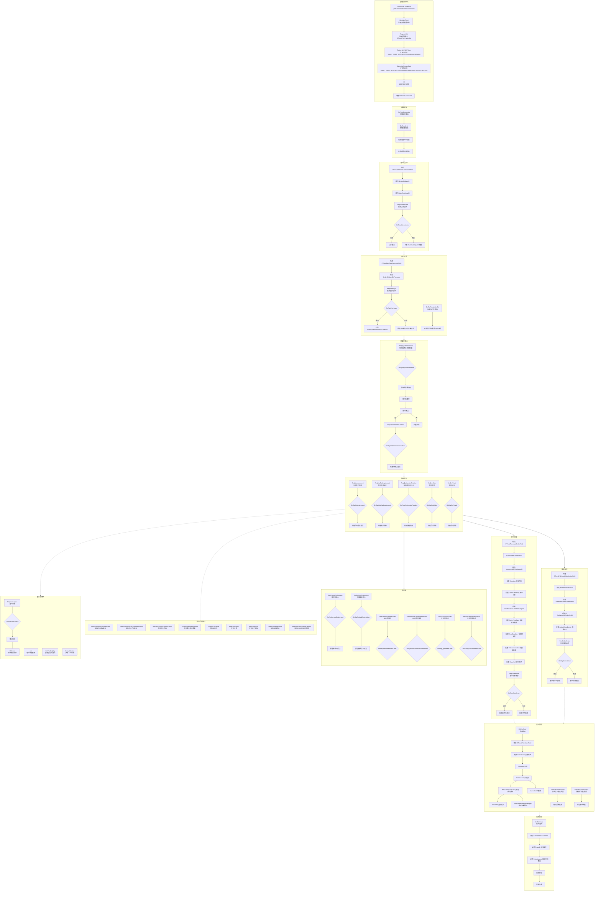

### 1.3 CTP 回报状态机（基于真实 API 定义）

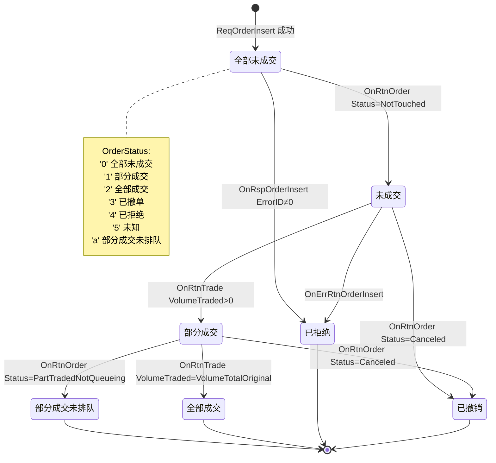

### 1.4 CTP 行情数据结构（CThostFtdcDepthMarketDataField）

```mermaid
flowchart LR
    subgraph DepthMarketData[CThostFtdcDepthMarketDataField 深度行情]
        direction TB
        D1[TradingDay 交易日] 
        D2[InstrumentID 合约代码]
        D3[ExchangeID 交易所代码]
        D4[ExchangeInstID 合约在交易所的代码]
        D5[LastPrice 最新价]
        D6[PreSettlementPrice 上次结算价]
        D7[PreClosePrice 昨收盘]
        D8[PreOpenInterest 昨持仓量]
        D9[OpenPrice 今开盘]
        D10[HighestPrice 最高价]
        D11[LowestPrice 最低价]
        D12[Volume 数量]
        D13[Turnover 成交金额]
        D14[OpenInterest 持仓量]
        D15[ClosePrice 今收盘]
        D16[SettlementPrice 本次结算价]
        D17[UpperLimitPrice 涨停板价]
        D18[LowerLimitPrice 跌停板价]
        D19[PreDelta 昨虚实度]
        D20[CurrDelta 今虚实度]
        D21[UpdateTime 最后修改时间]
        D22[UpdateMillisec 最后修改毫秒]
        D23[BidPrice1 申买价一]
        D24[BidVolume1 申买量一]
        D25[AskPrice1 申卖价一]
        D26[AskVolume1 申卖量一]
        D27[BidPrice2-5 申买价二至五]
        D28[BidVolume2-5 申买量二至五]
        D29[AskPrice2-5 申卖价二至五]
        D30[AskVolume2-5 申卖量二至五]
        D31[AveragePrice 均价]
        D32[ActionDay 业务日期]
    end

    D1 --> D2 --> D3 --> D4 --> D5 --> D6 --> D7 --> D8 --> D9 --> D10
    D10 --> D11 --> D12 --> D13 --> D14 --> D15 --> D16 --> D17 --> D18
    D18 --> D19 --> D20 --> D21 --> D22 --> D23 --> D24 --> D25 --> D26
    D26 --> D27 --> D28 --> D29 --> D30 --> D31 --> D32
```

### 1.5 CTP 交易 API 回调接口完整列表

```mermaid
flowchart TB
    subgraph Callback_Connect[连接相关回调]
        C1[OnFrontConnected<br/>连接成功]
        C2[OnFrontDisconnected<br/>连接断开]
        C3[OnHeartBeatWarning<br/>心跳警告]
        C4[OnRtnPrivateSeqNo<br/>私有流序号]
    end

    subgraph Callback_Auth[认证登录回调]
        C5[OnRspAuthenticate<br/>认证响应]
        C6[OnRspUserLogin<br/>登录响应]
        C7[OnRspUserLogout<br/>登出响应]
        C8[OnRspUserAuthMethod<br/>认证模式查询]
        C9[OnRspGenUserCaptcha<br/>图形验证码]
        C10[OnRspGenUserText<br/>短信验证码]
    end

    subgraph Callback_Order[报单相关回调]
        C11[OnRspOrderInsert<br/>报单录入响应]
        C12[OnRspOrderAction<br/>报单操作响应]
        C13[OnRtnOrder<br/>报单通知]
        C14[OnErrRtnOrderInsert<br/>报单录入错误]
        C15[OnErrRtnOrderAction<br/>报单操作错误]
        C16[OnRspParkedOrderInsert<br/>预埋单响应]
        C17[OnRspParkedOrderAction<br/>预埋撤单响应]
        C18[OnRspBatchOrderAction<br/>批量撤单响应]
        C19[OnErrRtnBatchOrderAction<br/>批量撤单错误]
    end

    subgraph Callback_Trade[成交相关回调]
        C20[OnRtnTrade<br/>成交通知]
        C21[OnRspQryMaxOrderVolume<br/>最大报单量]
    end

    subgraph Callback_Query[查询响应回调]
        C22[OnRspQryOrder<br/>查询报单]
        C23[OnRspQryTrade<br/>查询成交]
        C24[OnRspQryInvestorPosition<br/>查询持仓]
        C25[OnRspQryTradingAccount<br/>查询资金]
        C26[OnRspQryInstrument<br/>查询合约]
        C27[OnRspQryInvestor<br/>查询投资者]
        C28[OnRspQrySettlementInfo<br/>查询结算单]
        C29[OnRspSettlementInfoConfirm<br/>结算确认]
        C30[OnRspQryNotice<br/>查询客户通知]
        C31[OnRspQryTradingNotice<br/>查询交易通知]
        C32[OnRspQryBrokerTradingParams<br/>查询交易参数]
        C33[OnRspQryBrokerTradingAlgos<br/>查询交易算法]
    end

    subgraph Callback_Exec[执行宣告回调]
        C34[OnRspExecOrderInsert<br/>执行宣告响应]
        C35[OnRspExecOrderAction<br/>执行操作响应]
        C36[OnRtnExecOrder<br/>执行宣告通知]
        C37[OnErrRtnExecOrderInsert<br/>执行宣告错误]
        C38[OnErrRtnExecOrderAction<br/>执行操作错误]
    end

    subgraph Callback_Quote[报价回调]
        C39[OnRspQuoteInsert<br/>报价录入响应]
        C40[OnRspQuoteAction<br/>报价操作响应]
        C41[OnRtnQuote<br/>报价通知]
        C42[OnErrRtnQuoteInsert<br/>报价录入错误]
        C43[OnErrRtnQuoteAction<br/>报价操作错误]
    end

    subgraph Callback_Other[其他回调]
        C44[OnRspError<br/>错误应答]
        C45[OnRtnInstrumentStatus<br/>合约状态]
        C46[OnRtnBulletin<br/>交易所公告]
        C47[OnRtnTradingNotice<br/>交易通知]
        C48[OnRtnErrorConditionalOrder<br/>条件单校验错误]
        C49[OnRtnForQuoteRsp<br/>询价通知]
        C50[OnRtnCFMMCTradingAccountToken<br/>监控中心令牌]
    end

    Callback_Connect --> Callback_Auth
    Callback_Auth --> Callback_Order
    Callback_Order --> Callback_Trade
    Callback_Trade --> Callback_Query
    Callback_Query --> Callback_Exec
    Callback_Exec --> Callback_Quote
    Callback_Quote --> Callback_Other
```

### 1.6 CTP 错误码处理流程

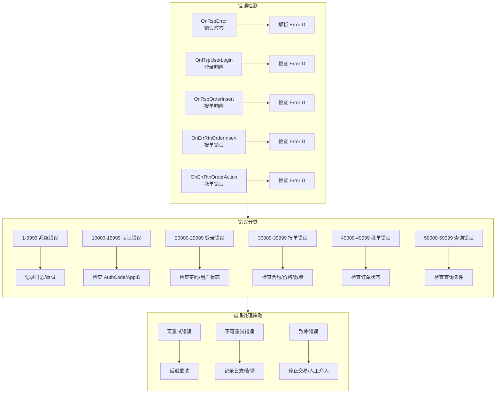

***

## 2. 业务层（Core）详细流程图

### 2.1 账户管理模块（Account.cpp）

> **管控链路**：**ACCOUNT（Account.json）→ CONFIG（解析 BrokerID 等）→ GATEWAY（验证配置完整性）→ TRADE（初始化 TdApi）**；**Account/Trade 加载均由 Gateway 统一控制**；UI 控制组件经 **HTTP → Gateway** 触发加载。

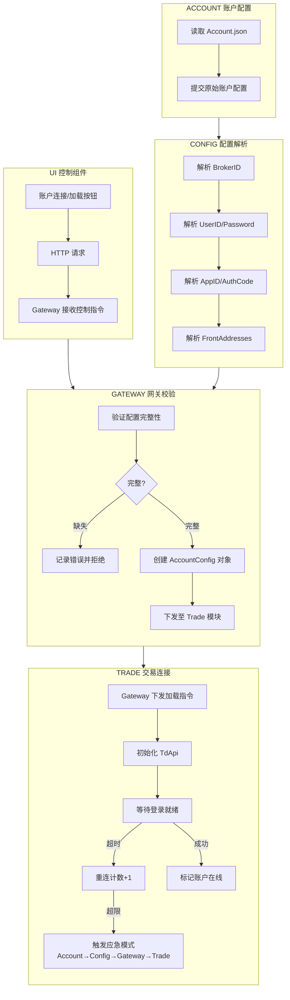

### 2.2 品种管理模块（Symbol.cpp）

> **管控链路**：**SYMBOL（Symbol_list.json）→ CONFIG（解析合约/规则）→ GATEWAY（品种验证）→ QUOTE（订阅管理）**；**Symbol/Quote 加载均由 Gateway 统一控制**；UI 控制组件经 **HTTP → Gateway** 触发加载。

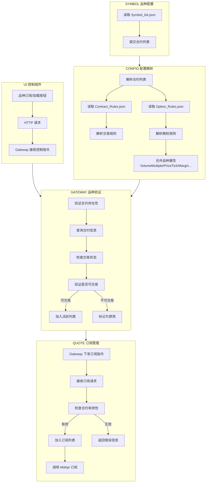

### 2.3 时间校验模块（Time\_Check）

> **管控链路**：**RISK（Risk.json）→ CONFIG（解析风险配置列表）→ GATEWAY（时间同步/时段管理）→ CTA（时间有效性检查/策略运行控制）**

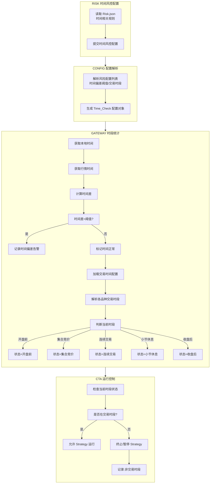

### 2.4 风险控制模块（Risk）

> **管控链路**：**RISK（Risk.json）→ CONFIG（解析风险配置列表）→ GATEWAY（频率/持仓/资金/应急风控）→ CTA（风控检查接口/策略放行）**

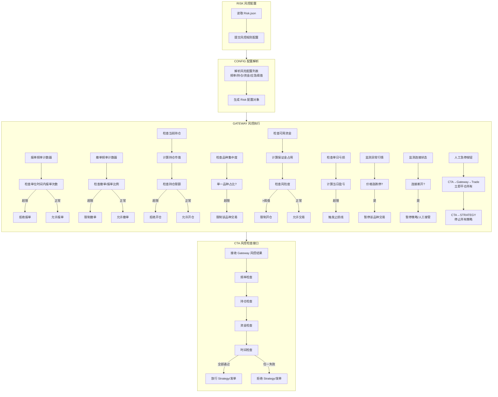

> **Trade 隔离原则**：Trade 模块**仅**与 Gateway 通信，禁止 CTA/UI/其他模块直连 Trade。发单须经 **Gateway → Trade**（策略：**CTA → Gateway**；人工：**UI → HTTP → Gateway**；Gateway 记录发单、执行风控路由）；回报须经 **Trade → Gateway → CTA**（Gateway 记录交易回报后再分发）。直连会导致无发单记录、无风险管理。

### 2.5 交易执行模块（trade.cpp）

> Trade **仅**接受 Gateway 控制加载与报单/撤单/查询；CTP 回报上报 Gateway 后由 **CTA（资管）** 维护资金/持仓视图，再经 **CTA → Gateway → HTTP/WS → UI** 推送。**无 Trade 本地镜像**。

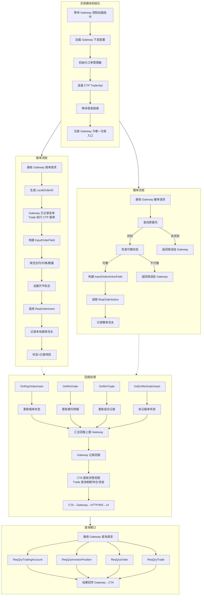

### 2.6 行情接入模块（quote.cpp）

> **Quote 加载/订阅由 Gateway 统一控制**（UI 控制组件 → HTTP → Gateway）。行情分发至 BLL（OB/Bar/Storage），**不经 CTA**。Tick 实时推送：**Quote → Gateway → WS → WEB**；K 线经 Storage 定时刷新后推送。

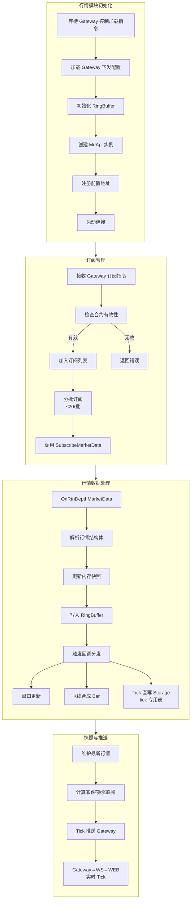

### 2.7 CTA 资管控制（CTA\_Engine）

> **本节描述 CTA_Engine 管控层**：决定**哪个 Strategy 运行**、传递运行参数、启停与报单协调。**Strategy_Engine 运行进程**见 **§3.4**。CTA **不传 Tick/Bar**；CTA 即资管中心，维护资金/持仓/委托视图。

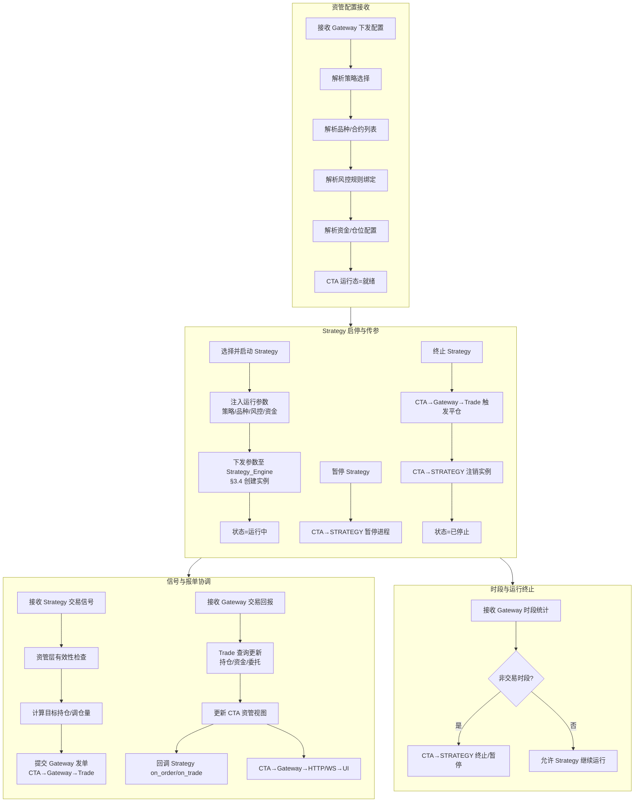

***

## 3. 逻辑层（BLL）详细流程图

### 3.1 盘口模块（Order\_Book.cpp）

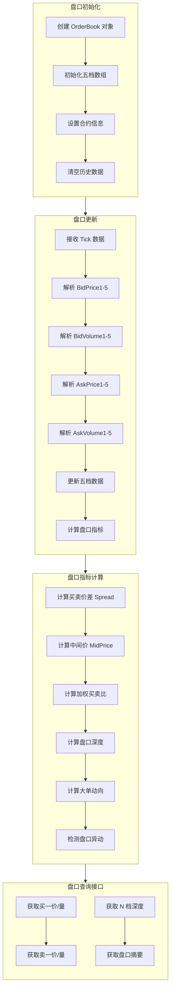

### 3.2 K线合成模块（Bar.cpp）

```mermaid
flowchart TB
    subgraph Bar_Init[K线引擎初始化]
        direction TB
        B1[创建 BarEngine] --> B2[设置周期列表<br/>1m/5m/15m/1h/1d]
        B2 --> B3[初始化各周期状态]
        B3 --> B4[从 Storage 加载历史数据]
    end

    subgraph Bar_1Min[1分钟 K线合成]
        direction TB
        B5[接收 Tick] --> B6[提取时间戳]
        B6 --> B7[判断新分钟?]
        B7 -->|是| B8[完成上一根 K线]
        B8 --> B9[初始化新 K线<br/>Open=Price]
        B7 -->|否| B10[更新当前 K线]
        B10 --> B11[High=max(High,Price)]
        B11 --> B12[Low=min(Low,Price)]
        B12 --> B13[Close=Price]
        B13 --> B14[Volume+=TickVolume]
    end

    subgraph Bar_MultiPeriod[多周期合成]
        direction TB
        B15[1分钟完成] --> B16[更新 5分钟]
        B16 --> B17[更新 15分钟]
        B17 --> B18[更新 1小时]
        B18 --> B19[更新日线]
        
        B20[判断周期边界] --> B21[完成当前周期]
        B21 --> B22[初始化下一周期]
    end

    subgraph Bar_Storage[K线存储]
        direction TB
        B23[Bar 完成] --> B23a[写入 Storage Bar 专用表<br/>落盘完成后才允许 Indicator/UI 读取]
        B23a --> B24[超限时归档文件]
        B24 --> B25[CSV 格式存储]
        B25 --> B26[按日期分文件]
    end

    subgraph Bar_Query[K线查询<br/>必须经 Storage]
        direction TB
        B27[请求查询] --> B28[从 Storage 读取]
        B28 --> B29[按周期/时间范围返回]
    end

    Bar_Init --> Bar_1Min
    Bar_1Min --> Bar_MultiPeriod
    Bar_MultiPeriod --> Bar_Storage
    Bar_Storage --> Bar_Query
```

### 3.3 指标计算模块（Indicator）

指标计算不自行实现公式，直接封装第三方库 [Tulip Indicators](https://tulipindicators.org/)（源码位于 `BLL/Indicator/tulipindicators`，编译 `tiamalgamation.c` + `indicators.h`）。各指标彼此独立，按名称按需调用，不存在固定串联顺序。

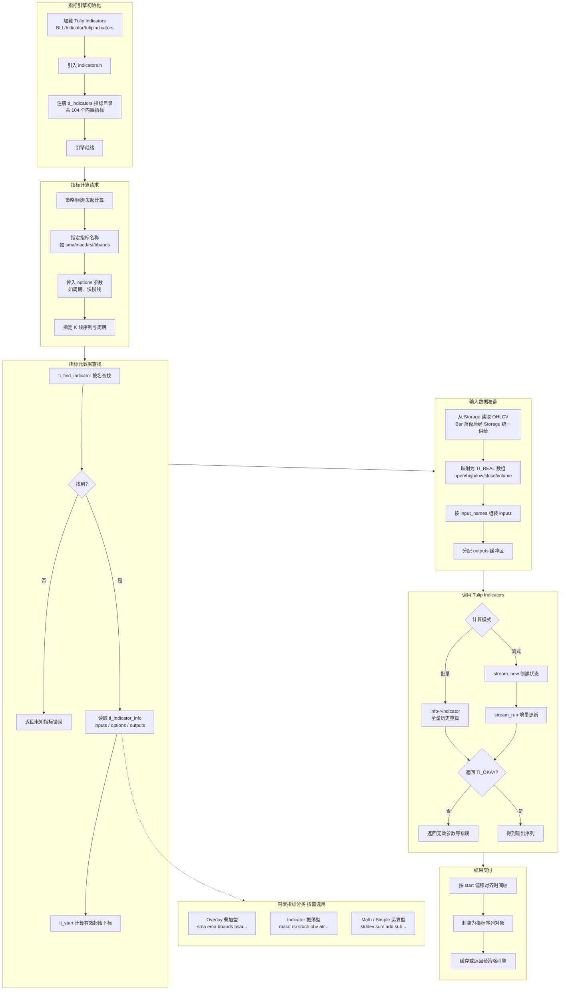

### 3.4 Strategy_Engine 策略运行进程（BLL 层）

> **本节描述 Strategy_Engine 运行进程**（创建实例、行情驱动、信号计算）。**CTA_Engine 管控**（选策略、传参、启停）见 **§2.7**。行情不经 CTA，独立经 **QUOTE → BAR → STORAGE → IND → Strategy** 驱动。

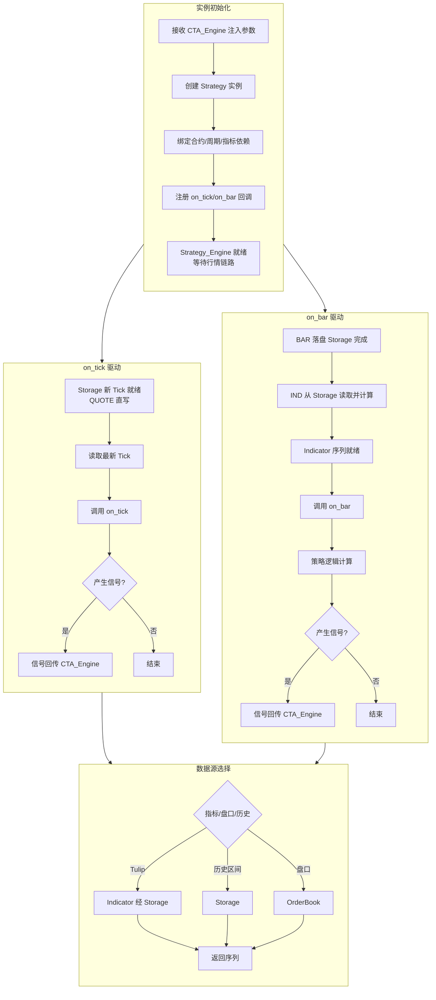

### 3.5 数据存储模块（storage.cpp）

```mermaid
flowchart TB
    subgraph Storage_Init[存储模块初始化]
        direction TB
        ST1[设置存储根目录] --> ST2[创建子目录结构]
        ST2 --> ST3[交易所/合约/日期]
        ST3 --> ST4[检查磁盘空间]
        ST4 --> ST5[初始化文件句柄池]
    end

    subgraph Storage_Tick[Tick 数据存储]
        direction TB
        ST6[接收 Tick<br/>Quote 直写] --> ST6a[写入 Tick 专用表/文件<br/>tick_{contract}_{date}.csv]
        ST6a --> ST7[格式化 CSV 行]
        ST7 --> ST8[字段:时间/价格/量/买卖盘]
        ST8 --> ST9[按日期分文件]
        ST9 --> ST10[异步写入磁盘]
        ST10 --> ST11[缓冲区管理<br/>落盘完成后才允许下游读取]
    end

    subgraph Storage_Bar[Bar 数据存储]
        direction TB
        ST12[接收 K线<br/>Bar 模块写入] --> ST12a[写入 Bar 专用表/文件<br/>bar_{period}_{contract}_{date}.csv]
        ST12a --> ST13[按周期分目录]
        ST13 --> ST14[1m/5m/15m/1h/1d]
        ST14 --> ST15[格式化 OHLCV]
        ST16[字段:时间/开/高/低/收/量]
    end

    subgraph Storage_Query[数据查询]
        direction TB
        ST17[按合约查询] --> ST18[按日期范围查询]
        ST18 --> ST19[按时间周期查询]
        ST19 --> ST20[读取 CSV 文件]
        ST20 --> ST21[解析为数据结构]
    end

    subgraph Storage_Maintenance[存储维护]
        direction TB
        ST22[定期压缩旧数据] --> ST23[清理过期文件]
        ST23 --> ST24[备份重要数据]
    end

    Storage_Init --> Storage_Tick
    Storage_Init --> Storage_Bar
    Storage_Tick --> Storage_Query
    Storage_Bar --> Storage_Query
    Storage_Query --> Storage_Maintenance
```

### 3.6 回测系统（Backtest）

> 回测与实盘对齐：**Risk→Config→Gateway→CTA→Strategy** 传参；信号 **Strategy→CTA→Gateway→Match（模拟 Trade）**；行情 **BAR→Storage→IND→Strategy**。

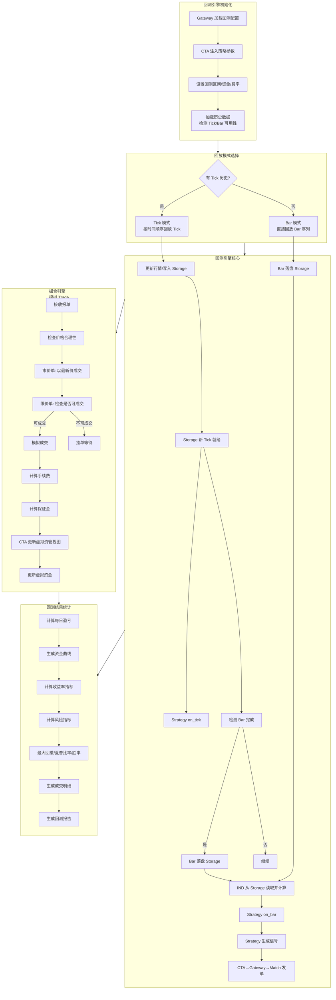

***

## 4. UI 可视化界面流程图

### 4.1 整体 UI 架构

> UI 经 **Host 层（HTTP / WS / Static）** 与 **Gateway** 衔接，对应 §5.1 Host\_Layer。页面与桥接脚本清单见 **`Web/Readme.md`**。

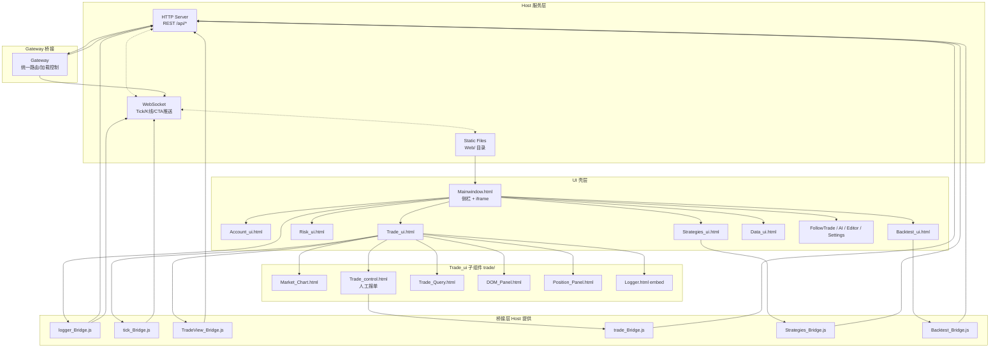

### 4.2 行情展示流程

> **Tick 实时**：Quote → Gateway → WS → WEB。**K 线**：Storage 定时刷新 → Gateway → WS → WEB（不经 HTTP→IND 中转，避免延迟）。

```mermaid
flowchart TB
    subgraph Quote_Flow[Tick 实时行情]
        direction TB
        QF1[WebSocket 连接] --> QF2[订阅合约列表]
        QF2 --> QF3[Gateway→WS 推送 Tick]
        QF3 --> QF4[解析 JSON]
        QF4 --> QF5[更新 Tick 展示]
    end

    subgraph KLine_Flow[K线展示]
        direction TB
        KF1[Storage Bar 定时刷新] --> KF2[Gateway 读取 Storage]
        KF2 --> KF3[Gateway→WS 推送 K线]
        KF3 --> KF4[更新 K线/成交量图]
    end

    subgraph Quote_Display[行情展示]
        direction TB
        QF6[合约列表] --> QF7[最新价/涨跌]
        QF7 --> QF8[买卖五档]
        QF8 --> QF9[分时图 Tick]
        QF9 --> KF4
    end

    subgraph Quote_Interaction[行情交互]
        direction TB
        QF12[点击合约] --> QF13[切换主图]
        QF13 --> QF14[经 Storage 加载历史 Bar]
        QF14 --> QF14a[Indicator API 指标策略 实盘<br/>Market_Chart→HTTP→Gateway→CTA→STRATEGY]
        QF14a --> QF14b[CTA→Gateway→WS/HTTP→UI 渲染]
        QF14b --> QF15[缩放/平移/切换周期]
        QF15 -.->|回测见 §5.2 Storage回放| QF14a
    end

    Quote_Flow --> Quote_Display
    KLine_Flow --> Quote_Display
    Quote_Display --> Quote_Interaction
```

### 4.3 交易操作流程

> **两条发单入口**（§5.1 总览）：
>
> 1. **人工下单**：`trade/Trade_control` → **UI → HTTP → Gateway → Trade**（不经 CTA 发信号）。
> 2. **策略发单**：Strategy → CTA → Gateway → Trade。
>
> 回报与账户数据：**Trade → Gateway → CTA（资管）→ Gateway → HTTP/WS → UI**；委托/持仓/资金 **数据源为 CTA**。

```mermaid
flowchart TB
    subgraph Trade_UI[交易界面]
        direction TB
        TU1[合约选择] --> TU2[买卖方向]
        TU2 --> TU3[开平选择]
        TU3 --> TU4[价格输入]
        TU4 --> TU5[数量输入]
        TU5 --> TU6[下单按钮]
    end

    subgraph Trade_Validate[前端校验]
        direction TB
        TU7[检查合约有效性] --> TU8[检查价格范围]
        TU8 --> TU9[检查数量有效性]
        TU9 --> TU10[检查资金充足性]
        TU10 -->|通过| TU11[HTTP 发送请求<br/>→ Gateway → Trade]
        TU10 -->|失败| TU12[显示错误提示]
    end

    subgraph Trade_Feedback[交易反馈]
        direction TB
        TU13[显示委托确认] --> TU14[等待 Gateway 回报]
        TU14 --> TU15[CTA 资管数据更新]
        TU15 --> TU16[Gateway→WS/HTTP 推送]
        TU16 --> TU17[更新委托/持仓/资金列表]
        TU17 --> TU18[成交提示音]
    end

    subgraph Trade_Query[查询功能<br/>均经 Gateway]
        direction TB
        TU19[查询委托] --> TU20[查询成交]
        TU20 --> TU21[查询持仓]
        TU21 --> TU22[查询资金]
        TU22 --> TU23[导出记录]
    end

    Trade_UI --> Trade_Validate
    Trade_Validate --> Trade_Feedback
    Trade_Feedback --> Trade_Query
```

### 4.4 回测界面流程

```mermaid
flowchart TB
    subgraph BT_UI[回测配置界面]
        direction TB
        BTU1[选择策略] --> BTU2[设置回测区间]
        BTU2 --> BTU3[选择合约列表]
        BTU3 --> BTU4[设置初始资金]
        BTU4 --> BTU5[设置手续费]
        BTU5 --> BTU6[开始回测按钮]
    end

    subgraph BT_Progress[回测进度]
        direction TB
        BTU7[显示进度条] --> BTU8[显示当前日期]
        BTU8 --> BTU9[显示处理速度]
        BTU9 --> BTU10[预计剩余时间]
    end

    subgraph BT_Result_UI[回测结果展示]
        direction TB
        BTU11[资金曲线图] --> BTU12[收益指标卡片]
        BTU12 --> BTU13[风险指标卡片]
        BTU13 --> BTU14[成交明细表]
        BTU14 --> BTU15[月度盈亏表]
        BTU15 --> BTU16[导出报告按钮]
    end

    BT_UI --> BT_Progress
    BT_Progress --> BT_Result_UI
```

### 4.5 风控监控界面

> 风控操作经 **UI → HTTP → Gateway → CTA**（§5.1 管控链终点）。

```mermaid
flowchart TB
    subgraph Risk_UI[风控监控面板]
        direction TB
        RU0[HTTP 拉取 CTA 资管数据] --> RU1[账户风险度]
        RU1 --> RU2[持仓盈亏汇总]
        RU2 --> RU3[当日交易统计]
        RU3 --> RU4[风控指标状态]
    end

    subgraph Risk_Alert[告警展示]
        direction TB
        RU5[Gateway→WS 实时告警] --> RU6[告警级别标识]
        RU6 --> RU7[告警时间戳]
        RU7 --> RU8[告警处理状态]
    end

    subgraph Risk_Control[风控操作]
        direction TB
        RU9[紧急平仓] --> RU9a[UI→HTTP→Gateway→CTA]
        RU9a --> RU9b[CTA→Gateway→Trade]
        RU10[暂停策略] --> RU10a[UI→HTTP→Gateway→CTA→STRATEGY]
        RU11[调整风控参数] --> RU11a[UI→HTTP→Gateway→Config]
        RU11a --> RU12[风控日志查看]
    end

    Risk_UI --> Risk_Alert
    Risk_Alert --> Risk_Control
```

***

## 5. 完整系统数据流图

> **架构要点**
>
> - **管控链路**：Risk → Config → Gateway → CTA → Strategy，从策略配置阶段即纳入风控与时间管控。
> - **CTA（Core）**：资管中心——选策略、传参、启停；**不传 Tick/Bar**；维护资金/持仓/委托视图。
> - **Strategy（BLL）**：运行进程（**§3.4**）；行情经 **QUOTE → BAR → STORAGE → IND → Strategy** 驱动 on\_tick / on\_bar。
> - **两条发单入口**（§5.1 须区分）：
>   - **策略发单**：Strategy → CTA → Gateway → Trade
>   - **人工发单**：Trade\_control / Trade\_ui → HTTP → Gateway → Trade（不经 CTA 发信号；回报仍 Trade → Gateway → CTA → UI）
> - **Trade 隔离**：Trade **仅**经 Gateway；回报 **Trade → Gateway → CTA**。
> - **UI 数据**：账户/委托/持仓/资金 **数据源为 CTA**，经 **CTA → Gateway → HTTP/WS → UI** 推送。
> - **行情 UI**：**Tick** Quote→Gateway→WS→WEB；**K 线** Storage 定时刷新→Gateway→WS→WEB。
> - **实时指标（Tulip）**：**HTTP → IND 直连**（低延迟）；历史指标经 Storage。
> - **Indicator API 指标策略**（须区分模式）：
>   - **实盘**：UI→HTTP→Gateway→CTA→STRATEGY→CTA→Gateway→WS/HTTP→UI（Market\_Chart 叠加）
>   - **回测**：Backtest\_ui→Gateway→CTA→STRATEGY；行情来自 Storage 回放，不经 Quote 实时链路（见 §5.2）
> - **加载控制**：Account/Symbol/Quote/Trade **均由 Gateway 控制**；UI 控制组件→HTTP→Gateway（页面清单见 **`Web/Readme.md`**）。
> - **Logger**：日志 **回传 Gateway** 统一路由。
> - **数据一致性**：Tick 直写 Storage；Bar 落盘 Storage 后供 IND/Strategy/K 线 UI 读取。

### 5.1 实盘交易完整数据流

```mermaid
flowchart TB
    subgraph Core_Layer[Core 业务层]
        direction TB
        RISK[Risk<br/>含 Time_Check]
        CONFIG[Config]
        GATEWAY[Gateway<br/>路由/加载控制/时段统计]
        ACCOUNT[Account]
        SYMBOL[Symbol]
        QUOTE[Quote]
        TRADE[Trade]
        CTA[CTA_Engine<br/>资管中心]
        LOGGER[Logger]

        RISK --> CONFIG
        SYMBOL --> CONFIG
        ACCOUNT --> CONFIG
        CONFIG --> GATEWAY
        CTA -->|策略发单请求| GATEWAY
        GATEWAY -->|记录发单/路由| TRADE
        TRADE -->|CTP回报/状态| GATEWAY
        GATEWAY -->|资管数据/配置/回报| CTA
        GATEWAY --> QUOTE
        GATEWAY --> LOGGER
        LOGGER -->|日志回传| GATEWAY
    end

    subgraph BLL_Layer[BLL 逻辑层]
        direction TB
        OB[OrderBook]
        BAR[Bar]
        IND[Indicator]
        STORAGE[Storage]
        STRATEGY[Strategy<br/>§3.4 运行进程]

        STORAGE -->|Tick读/on_tick| STRATEGY
        STORAGE -->|Bar读/统一读路径| IND
        IND -->|指标序列/on_bar| STRATEGY
        STRATEGY --> SRC{指标/盘口/历史}
        SRC -->|Tulip| IND
        SRC -->|历史| STORAGE
        SRC -->|盘口| OB
        OB --> STRATEGY
    end

    subgraph External[外部 CTP]
        CTP_MD[行情前置]
        CTP_TD[交易前置]
    end

    subgraph Host_Layer[Host 服务层]
        HTTP[HTTP Server]
        WS[WebSocket]
        STATIC[Static Web/]
    end

    subgraph UI_Layer[UI 前端 Web/]
        MW[Mainwindow.html]
        TC[trade/Trade_control<br/>人工报单]
        MC[trade/Market_Chart<br/>K线/Tick图]
        TQ[trade/Trade_Query<br/>委托/持仓]
        STRAT_UI[Strategies_ui]
    end

    CTP_MD -->|OnRtnDepthMarketData| QUOTE
    QUOTE -->|MdApi订阅| CTP_MD
    CTP_TD -->|OnRtnOrder/Trade| TRADE
    TRADE -->|ReqOrderInsert| CTP_TD

    QUOTE -->|Tick直写| STORAGE
    QUOTE --> BAR
    QUOTE --> OB
    BAR -->|Bar落盘| STORAGE
    QUOTE -->|Tick实时| GATEWAY
    STORAGE -->|K线定时刷新| GATEWAY

    GATEWAY -->|时段/风控结果| CTA
    CTA -->|传参/启停| STRATEGY
    STRATEGY -->|交易信号| CTA
    CTA -->|on_order/on_trade| STRATEGY

    GATEWAY -->|REST/控制/查询| HTTP
    GATEWAY -->|Tick/K线/CTA推送| WS
    STATIC --> MW
    HTTP --> MW
    WS --> MW
    MW --> TC
    MW --> MC
    MW --> TQ
    MW --> STRAT_UI

    TC -->|人工报单 REST| HTTP
    HTTP -->|报单不经CTA| GATEWAY
    TQ -->|资管查询 REST| HTTP
    HTTP -->|委托/持仓/资金| GATEWAY
    GATEWAY -->|CTA资管视图| CTA

    MC -->|历史Bar REST| HTTP
    HTTP -->|历史读| STORAGE
    MC -->|实时Tulip REST| HTTP
    HTTP -->|低延迟直连| IND
    MC -->|Indicator API 实盘| HTTP
    HTTP -->|指标策略路由| GATEWAY
    GATEWAY --> CTA
    CTA --> STRATEGY
    STRATEGY --> CTA
    CTA --> GATEWAY
    GATEWAY --> WS
    GATEWAY --> HTTP

    STRAT_UI -->|启停/传参 REST| HTTP
    HTTP --> GATEWAY
    MW -->|Account/Symbol加载| HTTP
```

### 5.2 回测系统完整数据流

> 与实盘对齐：**Gateway→CTA 传参**；**Strategy→CTA→Gateway→Match（模拟 Trade）**；行情 **BAR→Storage→IND→Strategy**。
>
> **Indicator API 指标策略（回测）**：Backtest\_ui → HTTP → Gateway → CTA → STRATEGY；指标计算走 **Storage 回放读路径**，**不经 Quote 实时链路与 HTTP→IND 直连**（与实盘 §5.1 区分）。

```mermaid
flowchart TB
    subgraph Data_Source[数据源]
        HIST_TICK[Tick 历史 CSV]
        HIST_BAR[Bar 历史 CSV]
    end

    subgraph BT_Core[回测核心]
        BT_GATEWAY[Gateway]
        BT_CTA[CTA_Engine]
        BT_ENGINE[Backtest Engine]
        BT_MATCH[Match Engine<br/>模拟 Trade]
    end

    subgraph BT_BLL[回测逻辑层]
        BT_TICK[Tick 回放]
        BT_BAR[Bar 回放/合成]
        BT_STORAGE[Storage 回放写入]
        BT_STRAT[Strategy 执行]
        BT_IND[Indicator]
        BT_RESULT[结果统计]
    end

    subgraph BT_UI[回测界面]
        BT_CONFIG[配置面板]
        BT_PROGRESS[进度显示]
        BT_CHART[结果图表]
        BT_REPORT[报告导出]
    end

    HIST_TICK --> BT_ENGINE
    HIST_BAR --> BT_ENGINE
    BT_CONFIG -->|HTTP→Gateway| BT_GATEWAY
    BT_GATEWAY --> BT_CTA
    BT_CTA -->|传参/启停| BT_STRAT

    BT_ENGINE -->|有 Tick| BT_TICK
    BT_ENGINE -->|仅 Bar| BT_BAR
    BT_TICK --> BT_BAR
    BT_BAR -->|Bar 落盘| BT_STORAGE
    BT_TICK -->|Tick 写 Storage| BT_STORAGE
    BT_STORAGE -->|统一读路径| BT_IND
    BT_STORAGE -->|on_tick| BT_STRAT
    BT_IND -->|on_bar| BT_STRAT
    BT_STRAT -->|请求指标| BT_IND
    BT_IND -->|指标序列| BT_STRAT
    BT_STRAT -->|交易信号| BT_CTA
    BT_CTA -->|发单| BT_GATEWAY
    BT_GATEWAY --> BT_MATCH
    BT_MATCH -->|回报| BT_GATEWAY
    BT_GATEWAY --> BT_CTA
    BT_CTA -->|更新虚拟资管| BT_STRAT

    BT_ENGINE --> BT_PROGRESS
    BT_ENGINE --> BT_RESULT
    BT_CTA --> BT_RESULT
    BT_RESULT --> BT_CHART
    BT_RESULT --> BT_REPORT
```

### 5.3 异常处理与应急流程

```mermaid
flowchart TB
    subgraph Error_Detect[异常检测]
        E1[行情断开检测]
        E2[交易断开检测]
        E3[风控阈值突破]
        E4[价格异常波动]
        E5[系统资源告警]
    end

    subgraph Error_Handle[异常处理]
        E6[自动重连机制]
        E7[策略暂停]
        E8[紧急平仓]
        E9[人工通知]
        E10[数据备份]
    end

    subgraph Recovery[恢复流程]
        E11[连接恢复检测]
        E12[数据同步]
        E13[状态校验]
        E14[策略重启]
        E15[恢复正常交易]
    end

    E1 --> E6
    E2 --> E6
    E3 --> E7
    E3 --> E8
    E4 --> E7
    E5 --> E9
    E5 --> E10
    
    E6 --> E6a[Account→Config→Gateway→Trade<br/>Quote 模块内自愈]
    E6a --> E11
    E7 --> E7a[Risk→Config→Gateway→CTA<br/>→STRATEGY 暂停]
    E7a --> E11
    E8 --> E8a[CTA→Gateway→Trade<br/>紧急平仓]
    E8a --> E11
    E11 --> E12
    E12 --> E13
    E13 --> E14
    E14 --> E15
```

***

## 附录：关键数据结构定义

### A.1 订单结构

```cpp
struct OrderField {
    string LocalOrderID;      // 本地订单号
    string OrderRef;          // CTP 报单引用
    string ExchangeID;        // 交易所
    string OrderSysID;        // 系统订单号
    string InstrumentID;      // 合约代码
    char Direction;           // 买卖方向
    char CombOffsetFlag;      // 开平标志
    double LimitPrice;        // 价格
    int VolumeTotalOriginal;  // 总数量
    int VolumeTraded;         // 已成交
    int VolumeTotal;          // 剩余
    char OrderStatus;         // 订单状态
    char StatusMsg[81];       // 状态信息
};
```

### A.2 成交结构

```cpp
struct TradeField {
    string TradeID;           // 成交编号
    string OrderRef;          // 报单引用
    string OrderSysID;        // 系统订单号
    string InstrumentID;      // 合约代码
    char Direction;           // 买卖方向
    char OffsetFlag;          // 开平标志
    double Price;             // 成交价格
    int Volume;               // 成交数量
    string TradeTime;         // 成交时间
};
```

### A.3 持仓结构

```cpp
struct PositionField {
    string InstrumentID;      // 合约代码
    char PosiDirection;       // 持仓方向
    int Position;             // 总持仓
    int YdPosition;           // 昨持仓
    int TodayPosition;        // 今持仓
    double OpenCost;          // 开仓成本
    double PositionCost;      // 持仓成本
    double PositionProfit;    // 持仓盈亏
    double Margin;            // 占用保证金
};
```

### A.4 资金结构

```cpp
struct AccountField {
    string AccountID;         // 账户编号
    double PreBalance;        // 昨结权益
    double Balance;           // 当前权益
    double Available;         // 可用资金
    double Margin;            // 保证金占用
    double PositionProfit;    // 持仓盈亏
    double CloseProfit;       // 平仓盈亏
    double Commission;        // 手续费
    double RiskDegree;        // 风险度
};
```

***

*文档结束*
