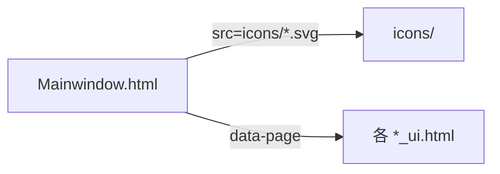

# Web/icons 图标资源

> 父级文档：[`Web/Readme.md`](../Readme.md)

侧栏导航使用的 **SVG 图标**，由 `Mainwindow.html` 引用。

---

## 文件列表

| 文件 | 用途 | Mainwindow 导航项 |
|------|------|-------------------|
| `account.svg` | 账户 | Account_ui.html |
| `trade.svg` | 交易 | Trade_ui.html |
| `risk.svg` | 风控 | Risk_ui.html |
| `strategy.svg` | 策略 | Strategies_ui.html |
| `follow.svg` | 跟单 | FollowTrade_ui.html |
| `ai-strategy.svg` | AI 策略 | AI_Strategy_ui.html |
| `backtest.svg` | 回测 | Backtest_ui.html |
| `editor.svg` | 编写 | Editor_ui.html |
| `data.svg` | 数据 | Data_ui.html |
| `settings.svg` | 设置 | Settings_ui.html |

另含 `ICONS_MAP.md`、`README.md`（图标映射说明，若有）。

---

## 引用方式

```html

```

路径相对于 `Web/` 根（Static 托管根目录）。

---

## 流程



新增导航页时：添加 SVG → 在 `Mainwindow.html` 增加 `<li class="nav-item" data-page="...">`。

---

## 规范

- 格式：SVG，单色或简洁双色，适配深色主题（`Mainwindow.css`）
- 尺寸：由 CSS `.nav-icon` 控制，源文件建议统一 viewBox
- 不包含业务逻辑；纯静态资源
