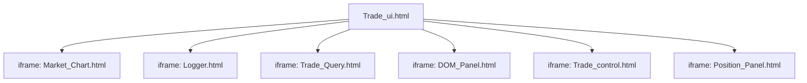
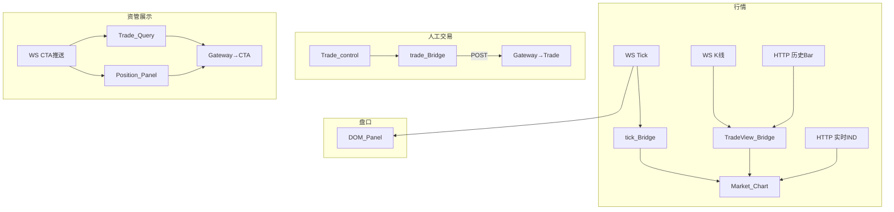

# Web/trade 交易子组件

> 父级文档：[`Web/Readme.md`](../Readme.md)  
> 架构准绳：[`Quant_Sev_Sod.md`](../../Quant_Sev_Sod.md) **§4.2**、**§4.3**、**§5.1**

本目录为 **Trade_ui.html** 以 iframe 加载的交易子面板，不负责侧栏导航。

---

## 目录结构

```
Web/trade/
├── Readme.md              # 本文档
├── Market_Chart.html      # 主图容器（K线/分时）
├── Market_Chart.js        # ECharts 图表逻辑
├── Market_Chart.css
├── Market_Chart_App.js    # 与 tick_Bridge / TradeView_Bridge 绑定
├── Trade_control.html     # 人工报单面板 ★
├── Trade_Query.html       # 委托/成交/资金查询
├── DOM_Panel.html         # 五档盘口
├── DOM_Panel.js
├── Position_Panel.html    # 持仓列表
├── Position_Panel.js
├── MACD_Chart.js          # MACD 副图逻辑
└── Chip_Chart.js          # 筹码分布副图
```

---

## 在 Trade_ui 中的布局



---

## 数据流



---

## 组件职责

| 文件 | 功能 | Gateway 路径 |
|------|------|--------------|
| `Market_Chart.*` | K 线、分时、指标叠加 | WS Tick/K线；HTTP Bar/IND；Indicator API→CTA |
| `Trade_control.html` | **人工发单入口** | HTTP→Gateway→**Trade**（不经 CTA 发信号） |
| `Trade_Query.html` | 委托/成交/资金 | HTTP/WS；数据源 **CTA** |
| `Position_Panel.html` | 持仓 | 同上 |
| `DOM_Panel.html` | 买卖五档 | WS Tick |
| `MACD_Chart.js` / `Chip_Chart.js` | 副图 | 由 Market_Chart 引用 |

---

## 两条发单入口（§5.1）

1. **本目录 Trade_control**：UI → HTTP → Gateway → Trade  
2. **策略发单**：BLL/Strategy → CTA → Gateway → Trade（不在此目录）

回报统一：**Trade → Gateway → CTA → WS/HTTP → Trade_Query / Position_Panel**

---

## 开发注意

- 子页面在 iframe 内运行，路径相对 `Web/trade/` 或 `Web/` 需与 Host Static 根一致
- 需父页或 Host 注入 `tick_Bridge.js`、`TradeView_Bridge.js`、`trade_Bridge.js`
- Bridge 未就绪时保持静态 UI，不调用 `QuantSevBridge`
