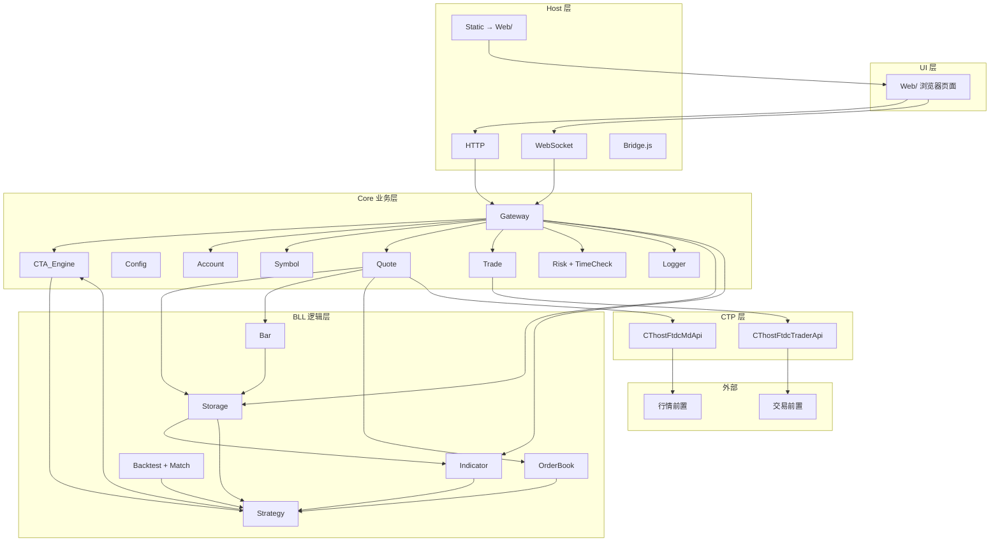

# Quant_Sev 系统框架（frame.md）

> **文档定位**
>
> | 文档 | 角色 | 是否随开发更新 |
> |------|------|----------------|
> | [`Quant_Sev_Sod.md`](Quant_Sev_Sod.md) | **流程图与设计准绳**（v1.5，只读参考） | ❌ 不修改 |
> | **`frame.md`（本文）** | **系统结构、模块清单、目录树、接口与依赖** | ✅ 随实现演进 |
> | [`plan.md`](plan.md) | **开发进度与 Phase 任务** | ✅ 每完成一项更新 |
> | `*/Readme.md` | **各目录实现说明与局部流程图** | ✅ 模块落地时更新 |
>
> 读法：**Sod 看「怎么做/流程」→ frame 看「是什么/在哪」→ plan 看「做到哪」→ 目录 Readme 看「怎么写代码」。**

版本：v1.0 · 日期：2026-05-30 · 对齐 Sod v1.5

---

## 1. 系统分层总览



---

## 2. 仓库目录树（目标结构）

```
Quant_Sev/
├── frame.md                 # 本文：系统结构总览
├── plan.md                  # 开发进度
├── Quant_Sev_Sod.md         # 流程图准绳（只读）
├── Readme.md
├── CMakeLists.txt           # [Phase1] 顶层构建
├── config/                  # [Phase1] 运行时配置
│   ├── Account.json
│   ├── Symbol_list.json
│   ├── Contract_Rules.json
│   ├── Risk.json
│   └── app.json             # Host 端口、Web 根路径等
├── data/                    # [Phase3] Storage 根目录
│   └── .gitkeep
├── CTP/                     # 官方 SDK 头文件
├── Host/
│   ├── Readme.md
│   ├── main.cpp             # [Phase1] 进程入口
│   ├── HttpServer/
│   ├── WebSocketServer/
│   └── bridges/
├── Core/
│   ├── Readme.md
│   ├── Gateway/             # [Phase1] 中枢
│   ├── Config/              # [Phase1]
│   ├── Logger/              # [Phase1]
│   ├── Account/             # [Phase2]
│   ├── Symbol/              # [Phase2]
│   ├── Quote/               # [Phase2]
│   ├── Trade/               # [Phase2]
│   ├── Risk/                # [Phase2]
│   ├── TimeCheck/           # [Phase2]
│   └── CTA/                 # [Phase2]
├── BLL/
│   ├── Readme.md
│   ├── Storage/             # [Phase3]
│   ├── Bar/                 # [Phase3]
│   ├── Indicator/           # tulipindicators/ 已有
│   ├── OrderBook/           # [Phase3]
│   ├── Strategy/            # [Phase3]
│   └── Backtest/            # [Phase3]
└── Web/                     # 静态 UI（已有）
```

`[PhaseN]` 对应 [`plan.md`](plan.md) 阶段。

---

## 3. 模块注册表

### 3.1 Core 层

| 模块 | 规划路径 | Sod | 职责 | 上游 | 下游 |
|------|----------|-----|------|------|------|
| **Gateway** | `Core/Gateway/` | §2、§5.1 | 统一路由、加载控制、HTTP/WS 桥 | Host | 全部 Core/BLL |
| **Config** | `Core/Config/` | §2.1–2.4 | 解析 JSON 配置 | config/*.json | Gateway |
| **Account** | `Core/Account/` | §2.1 | 账户、Gateway 触发 Td 加载 | Config、UI | Gateway→Trade |
| **Symbol** | `Core/Symbol/` | §2.2 | 合约校验、订阅 | Config、UI | Gateway→Quote |
| **TimeCheck** | `Core/TimeCheck/` | §2.3 | 交易时段、时间偏差 | Risk.json | Gateway→CTA |
| **Risk** | `Core/Risk/` | §2.4 | 频率/持仓/资金/应急 | Risk.json | Gateway、CTA |
| **Trade** | `Core/Trade/` | §2.5 | 仅 Gateway 报撤单；TraderApi | Gateway | CTP→Gateway→CTA |
| **Quote** | `Core/Quote/` | §2.6 | MdApi；Tick 分发 | Gateway | Storage/Bar/WS |
| **CTA_Engine** | `Core/CTA/` | §2.7 | 资管：策略/传参/启停/视图 | Gateway、Strategy | Gateway→Trade |
| **Logger** | `Core/Logger/` | §5.1 | 日志 | 各模块 | Gateway→UI |

### 3.2 BLL 层

| 模块 | 路径 | Sod | 职责 |
|------|------|-----|------|
| Storage | `BLL/Storage/` | §3.5 | Tick/Bar 持久化 |
| Bar | `BLL/Bar/` | §3.2 | K 线合成 |
| Indicator | `BLL/Indicator/` | §3.3 | Tulip；Storage 读 + HTTP 直连 |
| OrderBook | `BLL/OrderBook/` | §3.1 | 盘口 |
| Strategy | `BLL/Strategy/` | §3.4 | on_tick/on_bar → CTA |
| Backtest | `BLL/Backtest/` | §3.6 | 回放 + Match |

---

## 4. 核心数据路径（Invariant）

> 流程图详见 Sod **§5.0–§5.3**。

### 4.1 管控链

`Risk.json → Config → Gateway → CTA → Strategy`

### 4.2 行情链（不经 CTA）

```
CTP_MD → Quote → Tick直写 → Storage
              → Bar → Storage
Storage → Strategy(on_tick/on_bar) ← IND ← Storage
Quote/Storage → Gateway → WS → Web
```

### 4.3 交易链

| 场景 | 发单 | 回报 |
|------|------|------|
| 策略 | Strategy → CTA → Gateway → Trade | Trade → Gateway → CTA → UI |
| 人工 | Trade_control → HTTP → Gateway → Trade | 同上 |

### 4.4 指标策略

| 模式 | 路径 |
|------|------|
| 实盘 Tulip 实时 | HTTP → IND |
| 实盘 指标策略 | UI→Gateway→CTA→STRATEGY→… |
| 回测 | Storage 回放；不经 Quote/IND 直连 |

---

## 5. 配置与数据

### 5.1 config/

| 文件 | 消费者 |
|------|--------|
| `Account.json` | Account、Trade |
| `Symbol_list.json` | Symbol |
| `Contract_Rules.json` | Symbol |
| `Risk.json` | Risk、TimeCheck |
| `app.json` | Host、Gateway（端口、路径） |

### 5.2 data/ Storage 布局

```
data/{exchange}/{instrument}/{date}/
  tick_{instrument}_{date}.csv
  bar_{period}_{instrument}_{date}.csv
```

---

## 6. Host API 面（规划）

### 6.1 HTTP REST

| 路径 | 路由 | 数据源 |
|------|------|--------|
| `GET /api/status` | 状态 | Gateway |
| `GET /api/saved_accounts` | 账户 | Config |
| `POST /api/load/account` | 加载 Trade | Gateway |
| `POST /api/load/symbol` | 订阅 | Gateway→Quote |
| `POST /api/order` | 人工报单 | Gateway→Trade |
| `GET /api/orders` 等 | 资管查询 | Gateway→CTA |
| `GET /api/bars` | 历史 K 线 | Storage |
| `GET /api/indicator` | 指标 | IND/Storage |
| `POST /api/strategy/*` | 策略控制 | CTA |
| `GET /api/ui_logs` | 日志 | Logger |

### 6.2 WebSocket

| 主题 | 来源 |
|------|------|
| `tick.*` | Quote→Gateway |
| `bar.*` | Storage→Gateway |
| order/trade/position/account | CTA→Gateway |

---

## 7. 进程模型（规划）

单进程：Host + Gateway + Core + BLL。CTP 回调线程 → 入队 → Gateway 业务线程处理。

---

## 8. 构建（规划）

| Target | 说明 |
|--------|------|
| `quant_sev_core` | Core 静态库 |
| `quant_sev_bll` | BLL + Tulip |
| `quant_sev_host` | 可执行入口 |

依赖：CTP dll、HTTP/WS 库、nlohmann/json。

---

## 9. UI ↔ 后端

| 页面 | 后端 |
|------|------|
| Mainwindow | `/api/status` |
| Account_ui | saved_accounts、load |
| Trade_ui / trade/* | WS、order、CTA 查询 |
| Strategies_ui | strategy API |
| Risk_ui | CTA、急平 |
| Backtest_ui | backtest API |

---

## 10. 同步规则

1. **Quant_Sev_Sod.md** — 不修改。
2. **frame.md** — 结构/API/目录变更时更新。
3. **plan.md** — 进度与 Phase 状态。
4. **目录 Readme** — 代码落地时补充类名与文件列表。

---

## 11. Sod 索引

| frame | Sod |
|-------|-----|
| §4 数据路径 | §5.0–§5.3 |
| §3 Core/BLL | §2、§3 |
| §6 API | §4.1、§5.1 |
| CTP | §1、[CTP/README.md](CTP/README.md) |

---

## 12. 变更日志

| 版本 | 日期 | 内容 |
|------|------|------|
| v1.0 | 2026-05-30 | 初版系统框架，对齐 Sod v1.5 |
| v1.0.1 | 2026-05-30 | Phase 1：CMake、Host/Gateway/Config/Logger、config/、Bridge 占位 |
| v1.0.2 | 2026-05-30 | Phase 2：Account/Quote/Trade、Gateway 连接 API |
