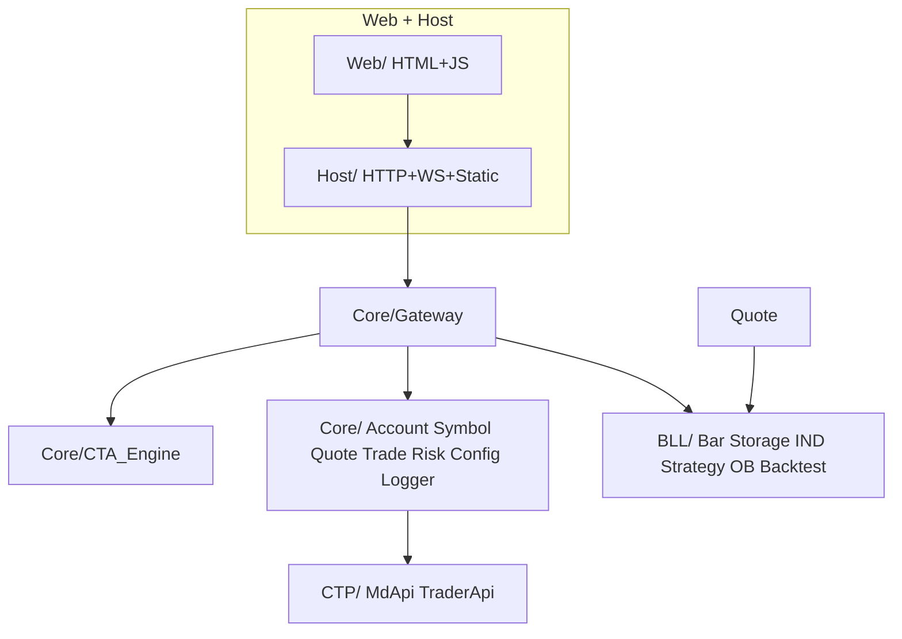

# Quant_Sev 开发计划（plan.md）

> **流程准绳（只读）**：[`Quant_Sev_Sod.md`](Quant_Sev_Sod.md)（v1.5）  
> **系统结构**：[`frame.md`](frame.md) — 模块、目录树、API、依赖  
> **进程记录**：本文档跟踪各层/各模块实现进度；每完成一项请更新状态并注明日期。  
> **目录说明**：各文件夹内 [`Readme.md`](Core/Readme.md) 记录该目录结构与流程图。

---

## 0. 功能开放状态（总览）

> 一眼区分：**已开发** = 代码已实现且可通过 Host/Web/API 使用；**未开放** = 尚未实现或未接入 UI/API。

### 图例

| 标识 | 含义 |
|------|------|
| 🟢 **已开发** | 已实现、已联调或可用；文档与代码一致 |
| 🟡 **部分开放** | 核心能力已有，缺 UI/多周期/边界场景等 |
| 🔒 **未开放** | 仅占位、规划或 Sod 要求但未落地 |

### 已开发（当前可用）

| 能力 | 入口 / 路径 | 备注 |
|------|-------------|------|
| 构建与运行 | `Quant_Sev.exe` / `quant_sev_host.exe` | VS2026 + CTP `v6.7.13`，生产模式握手 |
| HTTP 静态 UI | `http://127.0.0.1:8080` | Mainwindow、Account、Logger、Trade 页 |
| Tick WebSocket | `ws://127.0.0.1:8081/ws/tick` | 实盘 Tick + **委托/成交回报**（`type: order|trade`）广播 |
| 账户管理 | `/api/saved_accounts`、`/api/save_account` | `Account.json`，SimNow724 优先 |
| 行情连接 Md | `POST /api/load/md` | 成功后 **自动订阅** `Symbol_list.json` 全量（82 合约） |
| 交易连接 Td | `POST /api/load/td` | 登录 + 结算确认 |
| 人工报单 | `POST /api/order` | 限价/市价/对手价 → CTP ReqOrderInsert |
| 人工撤单 | `POST /api/cancel_order` | CTP ReqOrderAction；需 order_ref + instrument_id |
| 委托回报 | OnRtnOrder → WS + `GET /api/trade/orders` | 同步更新 CTA 委托状态 |
| 成交回报 | OnRtnTrade → WS + `GET /api/trade/trades` | **CTA 持仓按成交更新**；Trade_Query 成交 Tab |
| 历史查询 | `GET /api/trade/history` | ReqQryOrder/Trade + 日期筛选；**历史 Tab 已接** |
| Risk / TimeCheck | `GET /api/risk/status`、`POST /api/risk/halt`、`POST /api/risk/emergency` | 频率/持仓/时段/风险度；**CTP 真实资金校验**；急平+停策略 |
| CTA 资管 | `GET /api/strategies`、`/api/cta/*` | 策略启停、委托/持仓视图；**参数透传 days/k1/fast/slow** |
| 联调诊断 | `GET /api/diagnostic/pipeline`、`/api/diagnostic/bars` | SimNow 联调；Storage/回测 Bar 对齐 |
| Trade 页联动 | `trade_ui_Bridge.js` | 合约看板 + 图表/DOM/报单同步；CTP 账户信息 |
| 策略发单链 | `POST /api/strategy/signal` | CTA 校验 → Gateway → Trade |
| 历史回测 | `POST /api/backtest/run` | Bar/Tick/compare/**multi**；Option_Rules 乘数/tick；滑点/手续费可配 |
| 实盘 on_bar | Bar 落盘 → StrategyEngine | **m1/m15/h1/d1** 闭合级联 → 按策略 period 触发 |
| 合约订阅 | `POST /api/load/symbol` | `subscribe_all` / `instrument_ids` |
| 行情看板 | `GET /api/md_quote_board` | Symbol 列表 ∪ 实时 Quote |
| Market_Chart 实时 | Tick WS → 最后一根 K 线 | m1/m15/h1/d1 周期分桶与 BarEngine 对齐 |
| 历史 K 线 | `GET /api/bars` | 读 `data/.../m1.csv` 等 |
| 落盘清单 | `GET /api/data/inventory` | tick/m1/m15/h1/d1 文件条数、起止时间 |
| 指标计算 | `GET /api/indicator`、`/api/indicators` | Storage Bar + Tulip；**副图 MACD/RSI 已接 + Tick 增量重算** |
| Tick 落盘 | `data/{ex}/{product}/{month_slot}/tick.csv` | 与历史同目录 |
| m1 Bar 落盘 | `data/{ex}/{product}/{month_slot}/m1.csv` | Tick 合成，追加历史 |
| 多周期 Bar | `m15.csv` / `h1.csv` / `d1.csv` | m1 闭合级联聚合落盘 |
| 换月/路径规则 | `Contract_Rules.json` + `Symbol_list.json` | `ContractRules` 解析 instrument_id |
| 盘口 OrderBook | `GET /api/orderbook` | Tick 五档 + spread/深度/失衡；**Trade DOM 实时盘口** |
| 换月检测/应用 | `GET /api/rollover/suggest`、`POST /api/rollover/apply` | 日终快照 + 连续 N 日 vol+OI 判定 |
| 换月日终快照 | `POST /api/rollover/snapshot`、`GET /api/rollover/daily` | `data/rollover/daily_metrics.json` |
| 日志 | `/api/ui_logs`、Logger 页 | 含 CTP 连接日志 |

### 未开放（下一阶段）

（暂无阻塞项；见 §5 联调验证）

**当前 Phase**：Phase 5 联调验证中（CTA/Strategy on_bar 已接入；SimNow 端到端待验）

---

## 1. 项目总览

Quant_Sev 是期货量化交易系统，分层如下：

| 层级 | 目录 | Sod 章节 | 职责 |
|------|------|----------|------|
| CTP | `CTP/` | §1 | 官方行情/交易 API 头文件与错误码 |
| Core | `Core/` | §2 | 账户、品种、风控、交易、行情、CTA、Gateway、Config、Logger |
| BLL | `BLL/` | §3 | OrderBook、Bar、Indicator、Storage、Strategy、Backtest |
| Host | `Host/` | §4.1 / §5.1 | HTTP、WebSocket、静态资源、Bridge 脚本 |
| Web | `Web/` | §4 | 浏览器 UI 页面与组件 |

**核心约束（Sod §5.0）**

- 管控链：`Risk → Config → Gateway → CTA → Strategy`
- 行情链：`QUOTE → BAR → STORAGE → IND → Strategy`（不经 CTA）
- Trade 隔离：仅 `Gateway ↔ Trade`；回报 `Trade → Gateway → CTA → UI`
- 双发单：策略 `CTA→Gateway→Trade`；人工 `UI→HTTP→Gateway→Trade`

---

## 2. 开发阶段

**阶段图例**：🟢 已开发 · 🟡 部分开放 · 🔒 未开放 · ✅ 文档/基建完成

### Phase 0 — 架构与文档 ✅

| 项 | 状态 | 说明 |
|----|------|------|
| Quant_Sev_Sod.md v1.5 | ✅ | 全流程图与 §5.1 对齐 |
| frame.md v1.0 | ✅ | 系统结构、模块注册表、API 面 |
| CTP/README.md | ✅ | CTP API 与 DataType 整理 |
| Web/Readme.md | ✅ | UI 页面与 Gateway 路径 |
| plan.md + 各目录 Readme.md | ✅ | 本文档 |

### Phase 1 — 基础设施 🟢

| 模块 | 目录/文件 | Sod | 状态 | 备注 |
|------|-----------|-----|------|------|
| 构建骨架 | `CMakeLists.txt` | — | 🟢 | MSVC/MinGW；`Quant_Sev.exe` |
| 配置目录 | `config/`、`data/` | §2 | 🟢 | app.json、Account/Symbol/Risk |
| CTP SDK 部署 | `CTP/` + `CTP/lib/` | §1 | 🟢 | 自动链接 + POST_BUILD 复制 dll |
| Host | `Host/main.cpp` | §4.1 | 🟢 | HTTP :8080 + Tick WS :8081 |
| Bridge 脚本 | `Web/*_Bridge.js` | §4.1 | 🟡 | logger/tick/trade/TradeView/cta；Backtest 已接 |
| Gateway | `Core/Gateway/` | §2、§5.1 | 🟢 | 连接/订阅/bars/status 路由 |
| Config | `Core/Config/` | §2.1–2.4 | 🟢 | JSON 读写 |
| Logger | `Core/Logger/` | §5.1 | 🟢 | `/api/ui_logs` |

### Phase 2 — Core 交易与行情 🟡

| 模块 | 目录/文件 | Sod | 状态 | 备注 |
|------|-----------|-----|------|------|
| Account | `Core/Account/` | §2.1 | 🟢 | 多账户、`enabled` 优先解析 |
| Symbol | `Core/Symbol/` | §2.2 | 🟢 | `subscribe_all`、Md 后自动全量订阅 |
| Quote | `Core/Quote/` | §2.6 | 🟢 | MdApi、分批订阅、Tick 回调 |
| Trade | `Core/Trade/` | §2.5 | 🟢 | 登录/结算、报单、撤单、OnRtnOrder/OnRtnTrade 回报 |
| Time_Check | `Core/TimeCheck/` | §2.3 | 🟢 | Risk.json 交易时段；Gateway→CTA 报单前校验 |
| Risk | `Core/Risk/` | §2.4 | 🟢 | 频率/持仓/风险度/集中度/应急；**CTP 资金校验**；Risk_ui 联调 |
| CTA_Engine | `Core/CTA/` | §2.7 | 🟢 | 策略启停、资管视图、发单链 + 风控放行 |

### Phase 3 — BLL 逻辑层 🟡

| 模块 | 目录/文件 | Sod | 状态 | 备注 |
|------|-----------|-----|------|------|
| ContractRules | `BLL/Common/` | §2.2 | 🟢 | instrument_id + rollover JSON；**RolloverEngine 换月 suggest/apply** |
| Storage | `BLL/Storage/` | §3.5 | 🟢 | `tick.csv` / `{period}.csv` 同目录落盘 |
| Bar | `BLL/Bar/` | §3.2 | 🟢 | m1 Tick 合成；m15/h1/d1 级联落盘 + **多周期 on_bar 回调** |
| Indicator | `BLL/Indicator/` | §3.3 | 🟢 | Tulip 封装；Storage 读 Bar + HTTP API |
| OrderBook | `BLL/OrderBook/` | §3.1 | 🟢 | 五档盘口 + spread/深度/失衡；`GET /api/orderbook` |
| Strategy | `BLL/Strategy/` | §3.4 | 🟡 | DualThrust + **MA Cross** on_bar；按 period 过滤 |
| Backtest | `BLL/Backtest/` | §3.6、§5.2 | 🟡 | 多策略 + 滑点/手续费 + Option_Rules 合约参数 |

### Phase 4 — UI 对接 🟡

| 模块 | 目录 | Sod | 状态 | 备注 |
|------|------|-----|------|------|
| Mainwindow + 导航 | `Web/` | §4.1 | 🟢 | status 轮询、Tick WS、合约搜索→交易页 |
| 账户/交易/风控页 | `Web/` | §4.3–4.5 | 🟢 | Trade 合约/DOM/账户联动；持仓 CTA |
| trade 子组件 | `Web/trade/` | §4.2 | 🟢 | Market_Chart；DOM 五档；Trade_Query |
| Strategies_ui | `Web/Strategies_ui.html` | §4.x | 🟢 | 策略启停 + SimNow 联调诊断面板 |
| Data_ui | `Web/Data_ui.html` | §4.x | 🟢 | 落盘清单 API + Bar 预览/对齐验证 |
| 回测 UI | `Web/Backtest_ui.html` | §4.4、§5.2 | 🟢 | 四 Tab + **数据核对**（回测 vs Storage） |

### Phase 5 — 联调与实盘 🟡

| 项 | 状态 | 验收 |
|----|------|------|
| SimNow 仿真 CTP 登录 | 🟢 | SimNow724 @ 40011/40001，Md+Td 成功 |
| Symbol_list 全量订阅 + 落盘 | 🟢 | 82 合约 tick.csv；m1 追加 |
| §5.1 实盘数据流端到端 | 🟡 | Tick/K线/WS + 报单 + CTA 持仓；**多周期 Strategy on_bar** |
| §5.2 回测对齐实盘 | 🟡 | Bar/Tick 对比；Tick intra-bar 撮合已实现 |
| §5.3 异常应急 | 🟡 | 急平/停策略/停单 + Md/Td 自动重连 |

---

## 3. 目录 Readme 索引

| 路径 | 文档 |
|------|------|
| [`frame.md`](frame.md) | 系统结构、模块注册表、API、依赖 |
| `CTP/Readme.md` | CTP API、DataType、错误码 |
| `Core/Readme.md` | Core 模块规划与管控/交易流程 |
| `BLL/Readme.md` | BLL 模块规划与行情驱动流程 |
| `BLL/Indicator/Readme.md` | Indicator 封装与 Tulip |
| `Host/Readme.md` | HTTP/WS/Static/Bridge |
| `Web/Readme.md` | UI 页面与 Gateway 数据路径 |
| `Web/trade/Readme.md` | 交易子组件嵌套与报单流程 |
| `Web/icons/Readme.md` | 侧栏图标资源 |

---

## 4. 变更日志

| 日期 | 内容 |
|------|------|
| 2026-05-30 | **Phase 4 UI 对接完成**：数据清单 API、回测数据核对 Tab、Data/Backtest/主窗口联动 |
| 2026-05-30 | **Trade 页联调**：合约看板渲染、图表/DOM/报单同步、CTP 账户；回测 Bar 对齐 API |
| 2026-05-30 | **联调 UI + d1 策略**：Strategies 诊断面板；Data Bar 验证；`demo_d1_swing`；pipeline bar_checks |
| 2026-05-30 | **SimNow 联调支撑**：CTA 策略参数透传；`/api/diagnostic/pipeline|bars`；持仓面板成交刷新 |
| 2026-05-30 | **BLL/Strategy + Backtest**：DualThrust、Match、on_bar→CTA、`POST /api/backtest/run` |
| 2026-05-30 | **BLL/Indicator**：Tulip 封装；`GET /api/indicator`、`/api/indicators` |
| 2026-05-30 | **Core/CTA**：策略启停、资管视图、策略发单链；Strategies/Position UI |
| 2026-05-30 | **多周期 Bar**：m15/h1/d1 级联聚合；`GET /api/bars?period=` |
| 2026-05-30 | **多周期 on_bar**：BarEngine m15/h1/d1 闭合回调 → StrategyEngine 按 period 过滤 |
| 2026-05-30 | **OrderBook UI + MA Cross 实盘**：DOM_Panel 接 API/WS；StrategyEngine ma_cross |
| 2026-05-30 | **CTA 成交回报链**：OnRtnTrade → apply_trade_update 更新持仓；Data_ui 换月面板 |
| 2026-05-30 | **换月连续日判定**：日终快照 `daily_metrics.json`、自动/手动 snapshot、confirmed suggest |
| 2026-05-30 | **OrderBook + 换月**：五档盘口 API；rollover suggest/apply + Symbol_list 更新 |
| 2026-05-30 | **Risk CTP 资金校验**：`use_ctp_account`、Td 连接刷新资金缓存、开仓可用/风险度校验 |
| 2026-05-30 | **Trade_Query 资金 Tab**：ReqQryTradingAccount + `GET /api/trade/account` |
| 2026-05-30 | **§5.3 重连策略**：Md/Td 断连检测 + 可配置间隔自动重连/重订阅 |
| 2026-05-30 | **回测扩展**：Option_Rules 合约参数、滑点/手续费/保证金比例、MA Cross、多策略 |
| 2026-05-30 | **Market_Chart 副图实时**：Tick 驱动 MACD/RSI 增量重算（EMA/Wilder RSI） |
| 2026-05-30 | **Trade_Query 历史 Tab**：ReqQryOrder/Trade + `GET /api/trade/history` |
| 2026-05-30 | **Market_Chart 实时**：Tick WS 更新最后一根 K 线（m1/m15/h1/d1 分桶） |
| 2026-05-30 | **成交回报**：OnRtnTrade → WS + `GET /api/trade/trades`；Trade_Query 成交 Tab |
| 2026-05-30 | **Risk 扩展 + Risk_ui**：风险度/品种集中度、`POST /api/risk/config`、实时面板 |
| 2026-05-30 | **回测 Tick 模式**：tick.csv 回放 + m1 合成 + 多周期聚合；Backtest_ui 模式切换 |
| 2026-05-30 | **Market_Chart**：K 线 `/api/bars`、副图 MACD/RSI `/api/indicator`（Tulip） |
| 2026-05-30 | **Risk / TimeCheck**：频率/持仓/时段校验接入 Gateway；Trade_Query 撤单+WS |
| 2026-05-30 | **撤单 / 委托回报**：`POST /api/cancel_order`、OnRtnOrder→WS、`GET /api/trade/orders` |
| 2026-05-30 | plan §0 已开发/未开放总览；Phase 2–5 状态同步；SimNow 全量订阅落盘联调 |
| 2026-05-30 | 落盘路径统一：`tick.csv` / `m1.csv`；Md 连接自动 `subscribe_all` |
| 2026-05-30 | CTP 生产模式、SimNow724 账户、GET /api/bars、Storage/Bar Phase 3 |
| 2026-05-30 | Symbol 订阅、Tick WebSocket :8081、CTP 自动链接、Bridge |
| 2026-05-30 | Phase 2：Account/Quote/Trade CTP 封装、Gateway 连接 API |
| 2026-05-30 | Phase 1 启动：frame.md、CMake、Host/Gateway/Config/Logger 骨架 |
| 2026-05-30 | 初版 plan.md；按 Sod v1.5 建立 Phase 0–5 |

---

## 5. 下一步（建议顺序）

1. 按核对流程验一遍：Data 落盘清单 → Backtest「数据核对」→ Trade 页 K 线/DOM 对照
2. SimNow 实盘：策略启停 + 成交后 CTA 持仓 vs 回测信号时间轴
3. §5.2 compare 模式长样本；§5.3 应急/重连演练
